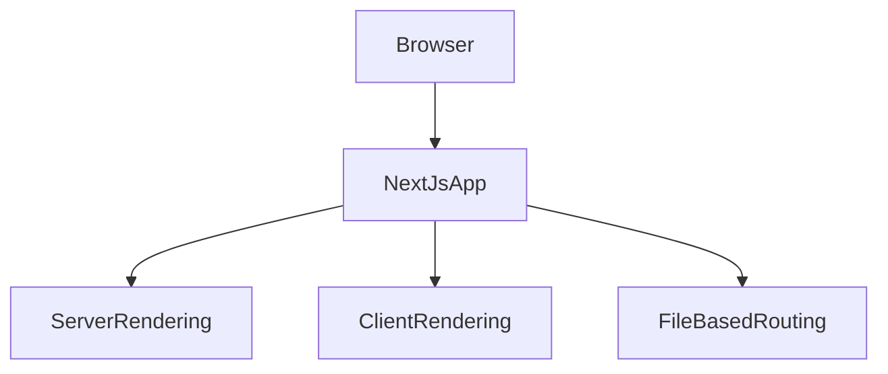

# Lesson 1: Introduction to Next.js

## Learning Objectives

By the end of this lesson, you will be able to:
- Explain what Next.js is and why it exists
- Describe the difference between SSR, SSG, and client-side rendering
- Understand the App Router mental model (server components by default)
- Know when to use server vs client components
- Run a Next.js dev server and locate the entry route (`app/page.tsx`)

## Why Next.js Matters

React is a UI library. Next.js is a framework that adds the “application” parts:
- routing
- server rendering and data fetching patterns
- bundling and optimization defaults
- deployment-friendly output

In real products, those pieces are what make your app fast, SEO-friendly, and maintainable.



## What is Next.js?

Next.js is a React framework that provides:
- **Server-Side Rendering (SSR)**: render pages on the server per request
- **Static Site Generation (SSG)**: pre-render pages at build time
- **App Router**: modern routing and layout system (Next.js 13+)
- **Route Handlers / API Routes**: build backend endpoints in the same project (optional)
- **Optimization**: automatic code splitting, image/font optimization, caching primitives

## Rendering Modes (High-Level)

### Client-side rendering (CSR)

- HTML is mostly a shell
- React runs in the browser to render content
- good for highly interactive apps, but SEO/perf can suffer if not handled carefully

### Server-side rendering (SSR)

- server renders HTML for the request
- faster first paint + better SEO
- requires thinking about server vs browser-only APIs

### Static generation (SSG)

- HTML is generated at build time
- great for docs/marketing/content sites
- can still be dynamic with revalidation/caching strategies

## App Router vs Pages Router

Next.js 13+ introduces the **App Router** (recommended):
- file-based routing in the `app/` directory
- layouts and nested routes are first-class
- **server components by default** (less JS shipped to the browser)

You may still see the older **Pages Router** (`pages/`) in legacy projects.

## Your First Next.js Page

In App Router, `app/page.tsx` is the home route (`/`).

```typescript
// app/page.tsx
export default function Home() {
  return (
    <main>
      <h1>Welcome to Next.js</h1>
      <p>This is the home page.</p>
    </main>
  );
}
```

## Running Your App

```bash
cd project
pnpm dev
```

Then open `http://localhost:3000`.

## Key Concepts (You’ll Use Constantly)

- **Routes**: folders under `app/` become routes
- **Pages**: `page.tsx` is a route entry
- **Layouts**: `layout.tsx` wraps routes with shared UI
- **Server Components**: default; run on server, ship less JS
- **Client Components**: opt-in with `"use client"` for interactivity

## Real-World Scenario: Why This Matters for a Full-Stack App

In a typical product:
- marketing pages are mostly static (SSG)
- authenticated pages often render on the server (SSR) and fetch user data securely
- interactive widgets (forms, modals) run on the client (client components)

## Best Practices

### 1) Default to server components

Only use client components where you need state, effects, event handlers, or browser APIs.

### 2) Keep boundaries explicit

Make it obvious which components are server-only vs client-only to avoid accidental runtime errors.

### 3) Optimize early with the right defaults

Next.js already optimizes a lot—use the framework primitives before reaching for custom solutions.

## Common Pitfalls and Solutions

### Pitfall 1: Using browser-only APIs in server components

**Problem:** Accessing `window`, `document`, `localStorage`, etc. in a server component.

**Solution:** Move that logic into a client component (`"use client"`) or into an effect.

### Pitfall 2: Making everything a client component

**Problem:** Adding `"use client"` everywhere ships more JS and can reduce performance.

**Solution:** Keep client components small and leaf-level when possible.

## Troubleshooting

### Issue: Dev server starts but you see a blank page or error overlay

**Symptoms:**
- red error overlay in browser
- terminal shows compile errors

**Solutions:**
1. Check the error overlay message and file path.
2. Confirm the route file exists: `app/page.tsx`.
3. Restart the dev server if you changed config files.

## Next Steps

Now that you understand what Next.js is and how the App Router works at a high level:

1. ✅ **Practice**: Edit `app/page.tsx` and confirm hot reload works
2. ✅ **Experiment**: Add a second route folder (`app/about/page.tsx`)
3. 📖 **Next Lesson**: Learn about [Pages and Routing](./lesson-02-pages-and-routing.md)
4. 💻 **Complete Exercises**: Work through [Exercises 01](./exercises-01.md)

## Additional Resources

- [Next.js Docs: App Router](https://nextjs.org/docs/app)
- [React Docs: Server Components](https://react.dev/reference/react/use-server)

---

**Key Takeaways:**
- Next.js adds routing, rendering strategies, and production-friendly defaults to React.
- App Router uses `app/` and server components by default.
- Use client components only when you need interactivity or browser APIs.
