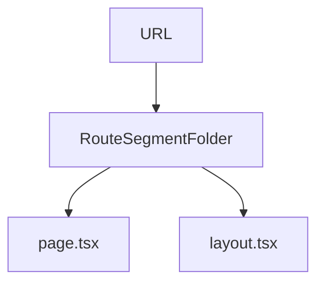

# Lesson 2: Pages and Routing

## Learning Objectives

By the end of this lesson, you will be able to:
- Explain how file-based routing works in the App Router
- Create static routes with `page.tsx` and shared UI with `layout.tsx`
- Build dynamic routes using `[param]` segments and read `params`
- Navigate between routes using `next/link`
- Recognize common routing pitfalls (wrong file placement, missing `page.tsx`, layout misunderstandings)

## Why Routing Matters

Routing is the backbone of any web app:
- it defines URLs (deep linking)
- it defines layouts and shared navigation
- it determines what data needs to load for each screen

In Next.js App Router, routing is **filesystem-driven**, which keeps structure predictable.



## File-Based Routing (App Router)

In the App Router, the file structure determines routes:

```
app/
├── page.tsx          → / (home)
├── about/
│   └── page.tsx      → /about
├── blog/
│   └── page.tsx      → /blog
└── contact/
    └── page.tsx      → /contact
```

### Rule of thumb

- a folder under `app/` is a **route segment**
- a `page.tsx` inside a segment defines the route entry

## Creating Pages

Each `page.tsx` file exports a default component:

```typescript
// app/about/page.tsx
export default function About() {
  return (
    <main>
      <h1>About Us</h1>
      <p>This is the about page.</p>
    </main>
  );
}
```

## Dynamic Routes

Use `[param]` for dynamic segments:

```
app/
└── blog/
    └── [slug]/
        └── page.tsx  → /blog/[slug]
```

```typescript
// app/blog/[slug]/page.tsx
export default function BlogPost({ params }: { params: { slug: string } }) {
  return <h1>Blog Post: {params.slug}</h1>;
}
```

### Real example

- `/blog/hello-world` → `params.slug === "hello-world"`

## Navigation (`next/link`)

Use Next.js `Link` component for client-side navigation (fast transitions, prefetching).

```typescript
import Link from "next/link";

export default function Navigation() {
  return (
    <nav>
      <Link href="/">Home</Link>{" "}
      <Link href="/about">About</Link>{" "}
      <Link href="/blog">Blog</Link>
    </nav>
  );
}
```

## Layouts (`layout.tsx`)

Use `layout.tsx` for shared layouts. Layouts wrap pages in that segment and below.

```typescript
// app/layout.tsx
export default function RootLayout({
  children,
}: {
  children: React.ReactNode;
}) {
  return (
    <html lang="en">
      <body>
        <header>Header</header>
        {children}
        <footer>Footer</footer>
      </body>
    </html>
  );
}
```

### Nested layouts

You can add `app/blog/layout.tsx` to create blog-specific wrappers without affecting other routes.

## Real-World Scenario: Dashboard + Public Site

Typical apps have:
- public routes: `/`, `/pricing`, `/blog`
- app routes: `/dashboard`, `/settings`

With App Router, you can create layout boundaries (e.g., dashboard sidebar) as nested layouts.

## Best Practices

### 1) Use layouts for shared UI

Navigation, footers, sidebars, and providers should live in layouts when shared.

### 2) Keep route segments readable

Use clear folder names and avoid over-nesting early.

### 3) Prefer `next/link` for internal navigation

It keeps routing fast and consistent.

## Common Pitfalls and Solutions

### Pitfall 1: Creating a folder but forgetting `page.tsx`

**Problem:** You create `app/about/` but it 404s.

**Solution:** Add `app/about/page.tsx` (the folder alone isn’t a route entry).

### Pitfall 2: Confusing layouts with pages

**Problem:** Putting page content in `layout.tsx` and expecting it to be a route.

**Solution:** Layouts wrap; pages render as the route entry.

## Troubleshooting

### Issue: 404 on a route you think exists

**Symptoms:**
- `/about` shows 404.

**Solutions:**
1. Confirm file path: `app/about/page.tsx`.
2. Restart dev server if the file was added while the server was in a bad state.
3. Check for typos/casing issues.

### Issue: Navigation full page reloads

**Symptoms:**
- clicking links reloads the page.

**Solutions:**
1. Use `next/link` for internal navigation.
2. Avoid `<a href="/...">` for internal routes unless you intentionally want a reload.

## Next Steps

Now that you understand pages and routing:

1. ✅ **Practice**: Add `/about` and `/contact`
2. ✅ **Experiment**: Add a dynamic route `/blog/[slug]` and print the slug
3. 📖 **Next Lesson**: Learn about [Components](./lesson-03-components.md)
4. 💻 **Complete Exercises**: Work through [Exercises 01](./exercises-01.md)

## Additional Resources

- [Next.js Docs: Routing](https://nextjs.org/docs/app/building-your-application/routing)
- [Next.js Docs: Layouts](https://nextjs.org/docs/app/building-your-application/routing/pages-and-layouts)

---

**Key Takeaways:**
- App Router routing is filesystem-based (`app/segment/page.tsx`).
- Dynamic routes use `[param]` and pass values via `params`.
- Layouts wrap pages and can be nested for shared UI.
- Use `next/link` for fast internal navigation.
