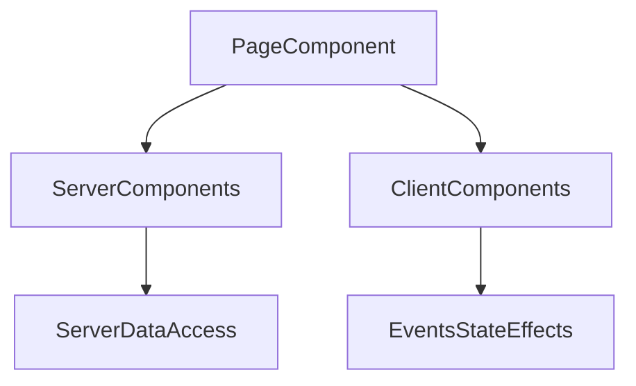

# Lesson 3: Components

## Learning Objectives

By the end of this lesson, you will be able to:
- Explain the difference between Server Components and Client Components
- Decide where a component should run (server vs client) and why
- Compose server and client components safely (and understand the boundary)
- Type component props cleanly with TypeScript
- Organize components in a maintainable folder structure

## Prerequisites

Before you start, make sure you have:

1. A Next.js App Router project created (follow `fs-course-frontend/LEARNING-GUIDE.md`)
2. A working `project/` folder (recommended: `fs-course-frontend/project/`)
3. A basic home page already rendering at `/` (from Lesson 1)

## Why Component Design Matters

Components are how you build UI with React/Next.js:
- reuse UI and logic
- keep pages small and readable
- enforce consistent design patterns

In the App Router, you also use components to control what runs on the server vs what ships to the browser.



## Basic Implementation

In this deep dive, you’ll build a small “server shell + client widget” page, which is one of the most common App Router patterns:

- a **server component** loads data (or prepares data)
- a **client component** handles interactivity (`useState`, events)
- the page composes them together safely (serializable props only)

### Step 1: Create a server component that prepares data

Create `project/components/server/FeaturedProduct.tsx`:

```typescript
// project/components/server/FeaturedProduct.tsx
export type FeaturedProduct = {
  id: string;
  name: string;
  priceCents: number;
};

async function getFeaturedProduct(): Promise<FeaturedProduct> {
  // Simulate server-side work (DB call, backend request, etc.)
  await new Promise((r) => setTimeout(r, 100));

  return { id: "p1", name: "Wireless Mouse", priceCents: 2999 };
}

export default async function FeaturedProductCard() {
  const product = await getFeaturedProduct();

  return (
    <section style={{ padding: 16, border: "1px solid #ddd" }}>
      <h2>Featured</h2>
      <p>{product.name}</p>
      <p>${(product.priceCents / 100).toFixed(2)}</p>
      <small>Product ID: {product.id}</small>
    </section>
  );
}
```

### Step 2: Create a client component for interactivity

Create `project/components/client/Counter.tsx`:

```typescript
// project/components/client/Counter.tsx
"use client";

import { useState } from "react";

export function Counter() {
  const [count, setCount] = useState(0);

  return (
    <div style={{ marginTop: 16 }}>
      <button onClick={() => setCount((c) => c + 1)}>Increment</button>
      <p>Count: {count}</p>
    </div>
  );
}
```

### Step 3: Compose them in a page

Update `project/app/page.tsx`:

```typescript
// project/app/page.tsx
import FeaturedProductCard from "../components/server/FeaturedProduct";
import { Counter } from "../components/client/Counter";

export default function Home() {
  return (
    <main style={{ padding: 24 }}>
      <h1>Components Deep Dive</h1>
      <FeaturedProductCard />
      <Counter />
    </main>
  );
}
```

### Step 4: Understand the boundary rule

Server components can render client components, but:
- ✅ pass **serializable** props (strings, numbers, booleans, plain objects)
- ❌ do not pass functions, class instances, DB clients, or non-serializable values

## Server Components (Default)

Server Components run on the server. In App Router, components are server components by default.

```typescript
// app/components/ServerComponent.tsx
export default async function ServerComponent() {
  // This runs on the server
  const data = await fetchDataFromDatabase();

  return <div>{data}</div>;
}
```

**Benefits:**
- No component JavaScript sent to the client (smaller bundles)
- Can access server resources (DB, internal services) securely
- Often faster initial load and better caching options

### Important note

The example uses `async` to emphasize the server environment. Server components can `await` data directly.

## Client Components

Use `"use client"` when you need:
- state (`useState`)
- effects (`useEffect`)
- event handlers (`onClick`, `onChange`)
- browser-only APIs (`window`, `localStorage`)

```typescript
// app/components/ClientComponent.tsx
"use client";

import { useState } from "react";

export default function ClientComponent() {
  const [count, setCount] = useState(0);

  return (
    <div>
      <p>Count: {count}</p>
      <button onClick={() => setCount((c) => c + 1)}>Increment</button>
    </div>
  );
}
```

## Component Composition (Server + Client)

It’s common to build server pages that render client widgets:

```typescript
import ServerComponent from "./components/ServerComponent";
import ClientComponent from "./components/ClientComponent";

export default function Page() {
  return (
    <div>
      <ServerComponent />
      <ClientComponent />
    </div>
  );
}
```

### Understanding the boundary

Server components can render client components, but you must be careful what data you pass across:
- pass serializable props (plain objects, strings, numbers)
- don’t pass server-only things (DB connections, functions that run on server, etc.)

## Props and TypeScript

Type your component props to prevent invalid usage:

```typescript
interface ButtonProps {
  label: string;
  onClick: () => void;
  disabled?: boolean;
}

export default function Button({ label, onClick, disabled }: ButtonProps) {
  return (
    <button onClick={onClick} disabled={disabled}>
      {label}
    </button>
  );
}
```

### Common pattern: children

```typescript
type CardProps = {
  title: string;
  children: React.ReactNode;
};

export function Card({ title, children }: CardProps) {
  return (
    <section>
      <h2>{title}</h2>
      {children}
    </section>
  );
}
```

## Component Organization

Organize components in a predictable structure:

```text
src/
  components/
    ui/
      Button.tsx
      Card.tsx
    layout/
      Header.tsx
      Footer.tsx
  app/
    page.tsx
```

## Complete Example: Server + Client Components in One Page

After completing the steps above, your `project/` should include:

```text
project/
├── app/
│   └── page.tsx
└── components/
    ├── client/
    │   └── Counter.tsx
    └── server/
        └── FeaturedProduct.tsx
```

## Real-World Scenario: Building a Product Page

A typical pattern is:
- server component loads product data
- client component handles “Add to cart” interactions

This keeps secrets and data fetching on the server, while interactivity stays on the client.

## Best Practices

### 1) Default to server components

Add `"use client"` only where needed.

### 2) Keep client components small

Make the interactive part a small leaf component; let the surrounding layout stay server-rendered.

### 3) Treat props as your component API

Strong prop types make components easy to use correctly and hard to misuse.

## Common Pitfalls and Solutions

### Pitfall 1: Using hooks in a server component

**Problem:** You call `useState`/`useEffect` without `"use client"`.

**Solution:** Mark the component as a client component or move the interactive code into a client child.

### Pitfall 2: Passing non-serializable props to a client component

**Problem:** Passing functions/classes/complex instances across the server→client boundary.

**Solution:** Pass primitives/plain objects; keep server-only behavior on the server.

### Pitfall 3: Making a “layout” client component unnecessarily

**Problem:** You add `"use client"` at the top of a big layout and ship lots of JS.

**Solution:** Keep the layout server-side; isolate only the interactive widget as client.

## Troubleshooting

### Issue: "You're importing a component that needs useState/useEffect..."

**Symptoms:**
- Next.js complains about hooks usage in server components.

**Solutions:**
1. Add `"use client"` to the component using hooks.
2. Move hook usage into a dedicated client component.

### Issue: "Functions cannot be passed to Client Components..."

**Symptoms:**
- You pass a function prop from server to client.

**Solutions:**
1. Replace function props with serializable data props.
2. Move the logic into the client component or use server actions (advanced topic).

## Testing Your Implementation

### Manual test checklist

1. Run `pnpm dev`.
2. Visit `/`.
3. Confirm:
   - the “Featured” card renders (server component)
   - clicking “Increment” updates the count (client component)

### Build-time check

```bash
pnpm build
```

If you see errors about hooks or serialization, double-check:
- `"use client"` is present at the top of the component using hooks
- you are not passing non-serializable props from server → client

## Next Steps

Now that you understand components in the App Router:

1. ✅ **Practice**: Build a server page that renders a small client counter widget
2. ✅ **Experiment**: Refactor a client-heavy page to use more server components
3. 📖 **Next Level**: Move to styling and layout with Tailwind
4. 💻 **Complete Exercises**: Work through [Exercises 01](./exercises-01.md)

## Additional Resources

- [Next.js Docs: Server and Client Components](https://nextjs.org/docs/app/building-your-application/rendering/composition-patterns)
- [React Docs: Components](https://react.dev/learn/your-first-component)

---

**Key Takeaways:**
- Server components are default and help ship less JS.
- Client components are for interactivity (state, effects, events, browser APIs).
- Compose server + client carefully across the boundary (serializable props).
- Strong prop types make components easier to use and refactor.
