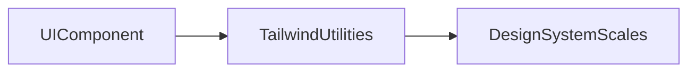

# Lesson 1: Tailwind CSS

## Learning Objectives

By the end of this lesson, you will be able to:
- Explain what “utility-first CSS” means and why Tailwind is popular
- Build common UI using Tailwind utilities (spacing, color, typography, layout)
- Extract reusable patterns with component composition (and when to use custom CSS)
- Customize your design system via `tailwind.config.ts`
- Recognize common pitfalls (class bloat, inconsistent spacing, fighting the cascade)

## Why Tailwind Matters

Tailwind changes how you approach styling:
- instead of writing lots of CSS selectors, you compose UI from small utility classes
- consistency comes from a shared scale (spacing, colors, typography)
- faster iteration: you see changes immediately without switching files



## What is Tailwind CSS?

Tailwind is a utility-first CSS framework that provides low-level utility classes like:
- `p-4` (padding)
- `text-lg` (font size)
- `bg-blue-500` (background color)
- `flex` (layout)

Instead of creating a `Button` CSS class, you compose styles inline using `className`.

## Using Tailwind Classes

```typescript
export default function Button() {
  return (
    <button className="bg-blue-500 text-white px-4 py-2 rounded">
      Click me
    </button>
  );
}
```

### What those classes mean

- `bg-blue-500`: background color
- `text-white`: text color
- `px-4 py-2`: horizontal and vertical padding
- `rounded`: border radius

## Common Utilities (You’ll Use Daily)

- **Colors**: `bg-blue-500`, `text-red-600`, `border-slate-200`
- **Spacing**: `p-4`, `m-2`, `px-6`, `py-3`, `gap-4`
- **Typography**: `text-xl`, `font-bold`, `leading-tight`, `text-center`
- **Layout**: `flex`, `grid`, `hidden`, `block`, `justify-between`, `items-center`
- **Sizing**: `w-full`, `max-w-md`, `h-10`
- **Effects**: `shadow`, `hover:shadow-lg`, `transition`
- **Responsive**: `md:text-lg`, `lg:flex`, `sm:px-6`

## A Real Button Pattern (Hover/Focus/Disabled)

```typescript
type ButtonProps = {
  label: string;
  disabled?: boolean;
  onClick: () => void;
};

export function Button({ label, disabled, onClick }: ButtonProps) {
  return (
    <button
      type="button"
      disabled={disabled}
      onClick={onClick}
      className={[
        "rounded px-4 py-2 font-medium",
        "bg-blue-600 text-white hover:bg-blue-700",
        "focus:outline-none focus:ring-2 focus:ring-blue-400",
        "disabled:opacity-50 disabled:cursor-not-allowed",
        "transition",
      ].join(" ")}
    >
      {label}
    </button>
  );
}
```

This demonstrates a key Tailwind idea: states are expressed as variants (`hover:`, `focus:`, `disabled:`).

## Customization (Design System)

Configure Tailwind in `tailwind.config.ts` to add brand colors, spacing, fonts, etc.

```typescript
export default {
  theme: {
    extend: {
      colors: {
        primary: "#your-color",
      },
    },
  },
};
```

### Why customizing matters

If you define `primary`, you reduce arbitrary one-off colors and keep the UI consistent.

## Real-World Scenario: Keeping UI Consistent on a Team

Your team is building a dashboard with lots of small UI pieces (buttons, cards, forms).

Without shared styling rules, you end up with:
- slightly different padding everywhere (`px-3` vs `px-4`)
- inconsistent colors (`bg-blue-600` vs `bg-sky-600`)
- missing focus states (bad accessibility)

Tailwind helps when you:
- agree on a shared scale (spacing/typography/colors)
- extract repeated class patterns into components (`Button`, `Card`)
- use consistent interaction states (`hover:`, `focus:`, `disabled:`)

## When to Use Custom CSS

Tailwind is great for most UI, but custom CSS can still be appropriate for:
- complex animations
- rare, highly custom layouts
- third-party components requiring overrides

In Next.js, you can use global styles (`globals.css`) and/or CSS modules for scoped styles.

## Best Practices

### 1) Prefer consistency over “perfect pixels”

Use the spacing scale (`p-4`, `gap-4`) instead of random values.

### 2) Extract repeated patterns into components

If the same class string repeats everywhere, it’s usually time to create a component.

### 3) Use states and accessibility utilities

Don’t forget focus states (`focus:ring`) and disabled states (`disabled:*`).

## Common Pitfalls and Solutions

### Pitfall 1: ClassName bloat in every component

**Problem:** Every file contains long class strings that are hard to read.

**Solution:** Extract UI components (`Button`, `Card`) and compose them.

### Pitfall 2: Inconsistent spacing and colors

**Problem:** UI looks “almost consistent” but not quite.

**Solution:** Prefer design tokens (theme extensions) and shared scales.

### Pitfall 3: Fighting layout with random utilities

**Problem:** You keep adding `mt-2`, `ml-3`, `relative`, etc. until it “looks right”.

**Solution:** Step back and use layout primitives (`flex`, `grid`, `gap`, `max-w-*`) intentionally.

## Troubleshooting

### Issue: Tailwind classes don’t apply

**Symptoms:**
- you add `bg-blue-500` but nothing changes

**Solutions:**
1. Confirm Tailwind is installed and configured in the project.
2. Confirm the file paths are included in Tailwind’s `content` config (otherwise classes may be purged).
3. Restart the dev server after config changes.

### Issue: Styles apply in dev but disappear in production

**Symptoms:**
- UI looks correct locally but not after build

**Solutions:**
1. Ensure Tailwind `content` includes all directories where you use `className`.
2. Avoid building class strings dynamically in a way Tailwind can’t detect (advanced).

## Next Steps

Now that you understand Tailwind fundamentals:

1. ✅ **Practice**: Build a `Card` component using spacing, borders, and typography utilities
2. ✅ **Experiment**: Add a `primary` color in `tailwind.config.ts` and use it consistently
3. 📖 **Next Lesson**: Learn about [Layouts](./lesson-02-layouts.md)
4. 💻 **Complete Exercises**: Work through [Exercises 02](./exercises-02.md)

## Additional Resources

- [Tailwind Docs](https://tailwindcss.com/docs)
- [Next.js Docs: Styling](https://nextjs.org/docs/app/building-your-application/styling)

---

**Key Takeaways:**
- Tailwind is utility-first: you compose UI from small classes.
- Consistency comes from shared scales (spacing/colors/typography).
- Use variants (`hover:`, `focus:`, `disabled:`) for interactive states.
- Extract repeated patterns into reusable UI components.
