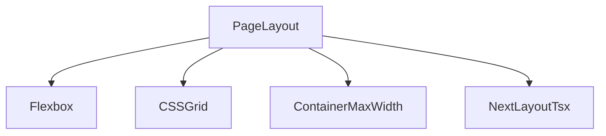
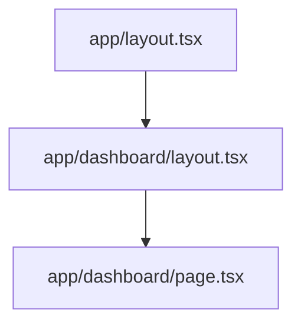

# Lesson 2: Layouts

## Learning Objectives

By the end of this lesson, you will be able to:
- Use Flexbox utilities to align and distribute content
- Use CSS Grid utilities for page and card layouts
- Use containers/max-width patterns to keep content readable
- Understand how Next.js `layout.tsx` works (root and nested layouts)
- Recognize common layout pitfalls (missing `gap`, misuse of `justify-*`, layout nesting confusion)

## Why Layout Matters

Layout is the difference between a UI that feels professional and one that feels “off”.

In modern apps you’ll constantly build:
- nav bars
- dashboards
- forms
- responsive grids

Tailwind gives you consistent primitives to build these quickly.



## Flexbox Layout

Flexbox is ideal for one-dimensional layouts (row or column).

```typescript
<div className="flex items-center justify-between">
  <div>Left</div>
  <div>Right</div>
</div>
```

### Common flex patterns

```typescript
<div className="flex gap-4">
  <div className="shrink-0">Icon</div>
  <div className="min-w-0">
    <p className="truncate">Long text that should truncate</p>
  </div>
</div>
```

Key utilities:
- `gap-*`: spacing between children (prefer this over `mr-*` everywhere)
- `items-*`: cross-axis alignment
- `justify-*`: main-axis distribution
- `flex-col`: switch to vertical layout

## Grid Layout

Grid is ideal for two-dimensional layouts (rows and columns), like cards or dashboards.

```typescript
<div className="grid grid-cols-3 gap-4">
  <div>Item 1</div>
  <div>Item 2</div>
  <div>Item 3</div>
</div>
```

### Responsive grid example

```typescript
<div className="grid grid-cols-1 sm:grid-cols-2 lg:grid-cols-3 gap-6">
  <div>Card</div>
  <div>Card</div>
  <div>Card</div>
</div>
```

## Container and Max Width

Readable apps rarely use the full screen width for text.

```typescript
<div className="container mx-auto px-4">
  Content with max width
</div>
```

Useful utilities:
- `max-w-*` (e.g., `max-w-2xl`) for specific content widths
- `mx-auto` to center
- `px-*` to ensure padding on small screens

## Next.js Layouts (`layout.tsx`)

In the App Router, `layout.tsx` defines shared UI around routes.

```typescript
// app/layout.tsx
export default function RootLayout({ children }: { children: React.ReactNode }) {
  return (
    <html lang="en">
      <body>
        <header>Header</header>
        <main>{children}</main>
        <footer>Footer</footer>
      </body>
    </html>
  );
}
```

### Nested layouts

You can add `app/dashboard/layout.tsx` to apply a sidebar only to dashboard routes:



## Real-World Scenario: Common App Shell

A common pattern:
- Root layout: global header/footer, fonts, providers
- Route layout: section-level navigation (dashboard sidebar)
- Page: the content for a specific screen

This keeps structure consistent and reduces duplicated markup.

## Best Practices

### 1) Prefer `gap-*` for spacing

It scales and reads better than manually spacing each child.

### 2) Use grid for cards and dashboards

Grid makes it easier to express columns and responsive breakpoints.

### 3) Keep layout components “dumb”

Layouts should mostly structure UI; keep feature logic deeper in pages/components.

## Common Pitfalls and Solutions

### Pitfall 1: Using `justify-between` when you really want `gap-*`

**Problem:** `justify-between` pushes items to edges and can create strange spacing.

**Solution:** Use `gap-*` for consistent spacing; use `justify-between` for “left vs right” alignment.

### Pitfall 2: Forgetting `min-w-0` in flex rows

**Problem:** `truncate` doesn’t work and text overflows.

**Solution:** Add `min-w-0` to the flex child that contains text.

### Pitfall 3: Confusing nested layouts

**Problem:** You put a layout in the wrong folder and it wraps routes unexpectedly.

**Solution:** Remember: layouts wrap their segment and all child segments.

## Troubleshooting

### Issue: Layout looks correct on desktop but breaks on mobile

**Symptoms:**
- content overflows or becomes unreadable

**Solutions:**
1. Add responsive grid/flex classes (`sm:`, `md:`, `lg:`).
2. Ensure containers use `px-*` padding for small screens.

### Issue: Text doesn’t truncate in a flex row

**Symptoms:**
- long text pushes layout wider

**Solutions:**
1. Add `min-w-0` to the flex child holding the text.
2. Add `truncate` to the text element.

## Next Steps

Now that you understand layout primitives:

1. ✅ **Practice**: Build a header using flex + gap
2. ✅ **Experiment**: Build a responsive card grid with `sm:` and `lg:` columns
3. 📖 **Next Lesson**: Learn about [Responsive Design](./lesson-03-responsive-design.md)
4. 💻 **Complete Exercises**: Work through [Exercises 02](./exercises-02.md)

## Additional Resources

- [Tailwind Docs: Flexbox](https://tailwindcss.com/docs/flex)
- [Tailwind Docs: Grid](https://tailwindcss.com/docs/grid-template-columns)
- [Next.js Docs: Pages and Layouts](https://nextjs.org/docs/app/building-your-application/routing/pages-and-layouts)

---

**Key Takeaways:**
- Use Flexbox for 1D layouts and Grid for 2D layouts.
- Prefer `gap-*` for spacing between children.
- Use containers/max-width to keep content readable.
- Next.js `layout.tsx` defines shared UI for route segments.
