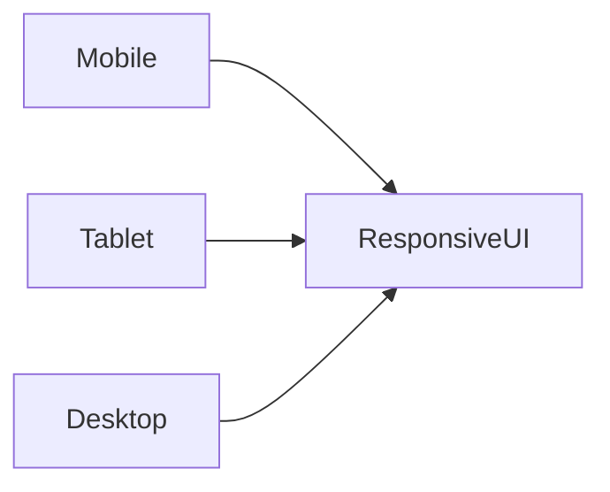

# Lesson 3: Responsive Design (Long-form Enhanced)

> Responsive design is a product requirement, not a polish step. This lesson focuses on mobile-first thinking, readable spacing/typography, and preventing common issues like layout shift and “works on desktop only” UI.

## Table of Contents

- Tailwind breakpoints (mobile-first)
- Responsive layout patterns (flex/grid)
- Responsive images (Next.js `Image`) and avoiding CLS
- Practical page shell example
- Pitfalls and troubleshooting

## Learning Objectives

By the end of this lesson, you will be able to:
- Explain “mobile-first” responsive design in Tailwind
- Use responsive variants (`sm:`, `md:`, `lg:`, `xl:`, `2xl:`) effectively
- Build responsive layouts with Flexbox/Grid + breakpoints
- Make images responsive using Next.js `Image` (and avoid common layout shifts)
- Recognize common pitfalls (overusing breakpoints, unreadable text, missing padding)

## Why Responsive Design Matters

Your users will view your app on:
- phones
- tablets
- laptops and desktops

Responsive design ensures your UI is usable and readable everywhere, not just on your screen.



## Breakpoints (Tailwind Defaults)

Tailwind breakpoints:
- `sm`: 640px
- `md`: 768px
- `lg`: 1024px
- `xl`: 1280px
- `2xl`: 1536px

These are **minimum widths** (mobile-first):
- base classes apply to all sizes
- `md:*` applies at `md` and up

## Responsive Classes (Examples)

```typescript
<div className="text-sm md:text-base lg:text-lg">
  Responsive text
</div>
```

This means:
- small screens: `text-sm`
- medium screens and up: `text-base`
- large screens and up: `text-lg`

## Mobile-First Layouts

Design for mobile first, then add larger breakpoints.

```typescript
<div className="flex flex-col md:flex-row">
  <div className="p-4">Left</div>
  <div className="p-4">Right</div>
</div>
```

On mobile: vertical stack  
On desktop: horizontal row

## Responsive Grids

```typescript
<div className="grid grid-cols-1 sm:grid-cols-2 lg:grid-cols-3 gap-6">
  <div>Card</div>
  <div>Card</div>
  <div>Card</div>
</div>
```

This is one of the most common real-world patterns for lists and dashboards.

## Responsive Images (Next.js `Image`)

Use Next.js `Image` to get optimization benefits (format selection, resizing, lazy loading).

```typescript
import Image from "next/image";

<Image
  src="/image.jpg"
  alt="Description"
  width={500}
  height={300}
  className="w-full h-auto"
/>;
```

### Why width/height matter

Providing dimensions helps prevent layout shift (CLS) by reserving space before the image loads.

### A more realistic `Image` pattern (sizes)

When images render at different sizes across breakpoints, the `sizes` prop helps the browser pick the right resource:

```typescript
import Image from "next/image";

<Image
  src="/hero.jpg"
  alt="Hero"
  width={1600}
  height={900}
  sizes="(max-width: 768px) 100vw, 50vw"
  className="w-full h-auto rounded"
/>;
```

## Real-World Scenario: A Responsive Page Shell

Typical pattern:
- centered container
- padding on mobile
- max width on desktop

```typescript
<div className="mx-auto max-w-5xl px-4 sm:px-6 lg:px-8">
  <h1 className="text-2xl sm:text-3xl font-bold">Dashboard</h1>
</div>
```

## Best Practices

### 1) Start small, scale up

Build the mobile layout first, then add breakpoints only where needed.

### 2) Use spacing + containers to maintain readability

On small screens, readability usually improves more from **consistent spacing** than from complex layouts.
Default to a centered container with mobile padding (e.g., `px-4 sm:px-6 lg:px-8`) and avoid very wide text blocks.

### 3) Prefer fewer breakpoints

If you have `sm:`, `md:`, `lg:`, `xl:` on every element, the UI becomes hard to maintain.
Add breakpoints only where the layout meaningfully changes.

## Common Pitfalls and Solutions

### Pitfall 1: Designing desktop-first then “cramming” into mobile

**Problem:** The UI looks great on desktop but becomes unusable on phones.

**Solution:** Build the mobile layout first, then add breakpoints to enhance the layout as space increases.

### Pitfall 2: Missing padding on small screens

**Problem:** Content touches the edges of the screen and feels cramped.

**Solution:** Use consistent container padding like `px-4 sm:px-6 lg:px-8`.

### Pitfall 3: Layout shift from images

**Problem:** The page jumps when images load.

**Solution:** Use Next.js `Image` with dimensions and avoid “unknown height” containers above the fold.

Often the biggest mobile problem is missing padding and too-wide text blocks.

### 4) Prefer responsive primitives over one-off hacks

Use `grid-cols-*`, `flex-col`, `gap-*`, `max-w-*` instead of lots of manual margins.

## Troubleshooting

### Issue: The layout looks correct in dev but breaks on a real phone

**Symptoms:**
- text wraps unexpectedly
- buttons overflow

**Solutions:**
1. Use your browser responsive mode *and* test a real device when possible.
2. Look for fixed widths (`w-[500px]`, `min-w-*`) that don’t shrink.
3. Add `min-w-0` and `truncate` patterns where needed in flex layouts.

### Issue: Responsive classes don’t seem to work

**Symptoms:**
- `md:*` styles never show up

**Solutions:**
1. Confirm your browser width crosses the breakpoint.
2. Check that the class is spelled correctly (`md:` not `md;`).
3. Ensure Tailwind is configured and building correctly.

### Issue: Mobile layout overflows horizontally

**Symptoms:**
- horizontal scrollbar appears

**Solutions:**
1. Look for fixed widths (`w-[1000px]`, large `px-*`) and replace with responsive widths.
2. Use `max-w-*` and `w-full` where appropriate.
3. Add `min-w-0` in flex rows for truncation.

## Next Steps

Now that you understand responsive design fundamentals:

1. ✅ **Practice**: Build a responsive card grid (1 col → 2 cols → 3 cols)
2. ✅ **Experiment**: Make a header responsive (`text-2xl` → `text-3xl`)
3. 📖 **Next Level**: Move to state and data fetching
4. 💻 **Complete Exercises**: Work through [Exercises 02](./exercises-02.md)

## Additional Resources

- [Tailwind Docs: Responsive Design](https://tailwindcss.com/docs/responsive-design)
- [Next.js Docs: Image](https://nextjs.org/docs/app/building-your-application/optimizing/images)

---

**Key Takeaways:**
- Tailwind is mobile-first: base styles apply everywhere; `md:` applies at \( \ge \) `md`.
- Use breakpoints only where the layout truly needs to change.
- Responsive grids and containers solve most real-world layouts.
- Next.js `Image` helps performance and reduces layout shift when sized correctly.
