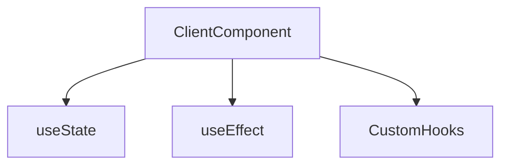

# Lesson 1: React Hooks (Long-form Enhanced)

> Hooks are a core React skill, but in Next.js App Router they also intersect with architecture: hooks usually mean **Client Components**. This lesson goes deeper on the “why” behind common rules so you can debug hook bugs confidently.

## Table of Contents

- Why hooks exist (mental model)
- `useState` and re-renders
- `useEffect` and dependency arrays
- Common pitfalls (stale closures, infinite loops, derived state)
- Custom hooks and reuse
- Advanced hooks (preview): `useMemo`, `useCallback`, `useReducer`
- Troubleshooting checklist

## Learning Objectives

By the end of this lesson, you will be able to:
- Explain what hooks are and why React uses them
- Use `useState` for component state and understand updates/re-renders
- Use `useEffect` for side effects and understand the dependency array
- Avoid common hook pitfalls (stale closures, infinite effects, derived state)
- Create custom hooks to reuse stateful logic across components

## Why Hooks Matter

Hooks are how modern React manages:
- state (data that changes over time)
- side effects (fetching data, subscriptions, timers)
- reusable behavior (custom hooks)

In Next.js App Router, most hooks require a **Client Component** because hooks run in the browser.



## `useState`

Use `useState` to manage component state.

```typescript
"use client";

import { useState } from "react";

export default function Counter() {
  const [count, setCount] = useState(0);

  return (
    <div>
      <p>Count: {count}</p>
      <button onClick={() => setCount((c) => c + 1)}>Increment</button>
    </div>
  );
}
```

### How updates work

- calling `setCount(...)` schedules a re-render
- React compares the new UI output and updates the DOM efficiently

### Functional updates (recommended)

If the next state depends on previous state, use a function:

```typescript
setCount((c) => c + 1);
```

This avoids “stale state” bugs.

## `useEffect`

Use `useEffect` for side effects (work outside rendering).

```typescript
"use client";

import { useEffect, useState } from "react";

async function fetchData(): Promise<string> {
  return "hello";
}

export default function Component() {
  const [data, setData] = useState<string | null>(null);

  useEffect(() => {
    let cancelled = false;

    fetchData().then((value) => {
      if (!cancelled) setData(value);
    });

    return () => {
      cancelled = true;
    };
  }, []);

  return <div>{data ?? "Loading..."}</div>;
}
```

### The dependency array (mental model)

- `[]`: run once on mount (and cleanup on unmount)
- `[x]`: re-run when `x` changes
- missing array: runs after every render (often a mistake)

## Common Hook Pitfalls

### 1) Infinite loops in `useEffect`

If your effect updates state that’s also in the dependency list, you can create loops.

### 2) Derived state

If a value can be computed from props/state, don’t store it as separate state. Compute it during render.

### 3) Stale closures

Effects “capture” values from the render that created them. Use dependencies or functional updates.

## Advanced Hooks (Preview)

You don’t need these on day one, but you’ll see them in production code.

### `useMemo` (performance + stability)

Use `useMemo` to avoid recomputing expensive values every render (and to keep stable references):

```typescript
"use client";

import { useMemo } from "react";

function expensiveCompute(items: number[]) {
  return items.reduce((sum, n) => sum + n, 0);
}

export function Total({ items }: { items: number[] }) {
  const total = useMemo(() => expensiveCompute(items), [items]);
  return <div>Total: {total}</div>;
}
```

### `useCallback` (stable function references)

`useCallback` is useful when you pass callbacks deep into child components and want stable references:

```typescript
import { useCallback, useState } from "react";

export function Parent() {
  const [count, setCount] = useState(0);
  const onClick = useCallback(() => setCount((c) => c + 1), []);
  return <button onClick={onClick}>Count: {count}</button>;
}
```

### `useReducer` (complex state transitions)

When state changes are complex or need to be very explicit, `useReducer` can be clearer than many `useState` calls.

## Troubleshooting

### Issue: “Effect runs in a loop”

**Common causes:**
- you update a dependency inside the effect
- you create a new object/array each render and put it in the dependency list

**Fixes:**
1. Move derived objects outside render or wrap them in `useMemo`.
2. Ensure you’re not setting state in a way that triggers the same effect repeatedly.

### Issue: “State updates don’t show up” / stale values

**Fixes:**
1. Use functional updates when the next state depends on the previous state.
2. Add the correct dependencies to `useEffect` (don’t “lie” to React to silence lint warnings).

## Custom Hooks

Custom hooks are functions that call hooks and encapsulate reusable logic.

```typescript
"use client";

import { useMemo, useState } from "react";

export function useCounter(initial = 0) {
  const [count, setCount] = useState(initial);

  const increment = () => setCount((c) => c + 1);
  const decrement = () => setCount((c) => c - 1);
  const reset = () => setCount(initial);

  return useMemo(
    () => ({ count, increment, decrement, reset }),
    [count, initial]
  );
}
```

### Why this is useful

You can reuse the same state logic across multiple components without copy/paste.

## Real-World Scenario: Client Form State

Forms are the most common hook use case:
- inputs → `useState`
- submit → async call
- side effects → show toast, redirect, etc.

## Best Practices

### 1) Keep hooks in client components

If you use `useState`/`useEffect`, add `"use client"` (or move logic into a client child component).

### 2) Prefer functional updates for state derived from previous state

This prevents race conditions and stale state bugs.

### 3) Keep effects focused

One effect should typically do one job: fetch data, subscribe, sync with localStorage, etc.

## Common Pitfalls and Solutions

### Pitfall 1: Forgetting `"use client"`

**Problem:** Hook usage in a server component.

**Solution:** Add `"use client"` to the file or move hook logic into a client component.

### Pitfall 2: Using `forEach`-style patterns in effects without cleanup

**Problem:** Subscriptions/timers continue after unmount.

**Solution:** Return a cleanup function from `useEffect`.

### Pitfall 3: Missing dependencies

**Problem:** Effect uses a variable but it isn’t in the dependency array.

**Solution:** Add the dependency (or restructure to avoid re-running).

## Troubleshooting

### Issue: "Invalid hook call"

**Symptoms:**
- React complains about invalid hook usage.

**Solutions:**
1. Ensure hooks are only called at the top level of React components/custom hooks.
2. Ensure you don’t call hooks conditionally (`if (...) useState(...)`).

### Issue: Effect runs too often

**Symptoms:**
- network requests happen repeatedly

**Solutions:**
1. Confirm you have the correct dependency array.
2. Avoid creating new function/object dependencies every render (advanced: `useCallback`, `useMemo`).

## Next Steps

Now that you understand hooks:

1. ✅ **Practice**: Build a small client counter and a client form using `useState`
2. ✅ **Experiment**: Add a `useEffect` that fetches data and cleans up properly
3. 📖 **Next Lesson**: Learn about [Data Fetching](./lesson-02-data-fetching.md)
4. 💻 **Complete Exercises**: Work through [Exercises 03](./exercises-03.md)

## Additional Resources

- [React Docs: State](https://react.dev/learn/state-a-components-memory)
- [React Docs: Effects](https://react.dev/learn/synchronizing-with-effects)
- [React Docs: Reusing Logic with Custom Hooks](https://react.dev/learn/reusing-logic-with-custom-hooks)

---

**Key Takeaways:**
- Hooks are how modern React manages state, side effects, and reusable behavior.
- `useState` triggers re-renders; use functional updates when state depends on previous state.
- `useEffect` runs after render; the dependency array controls when it re-runs.
- Custom hooks help you reuse logic across components cleanly.
