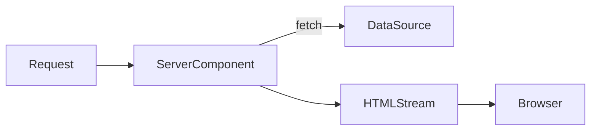
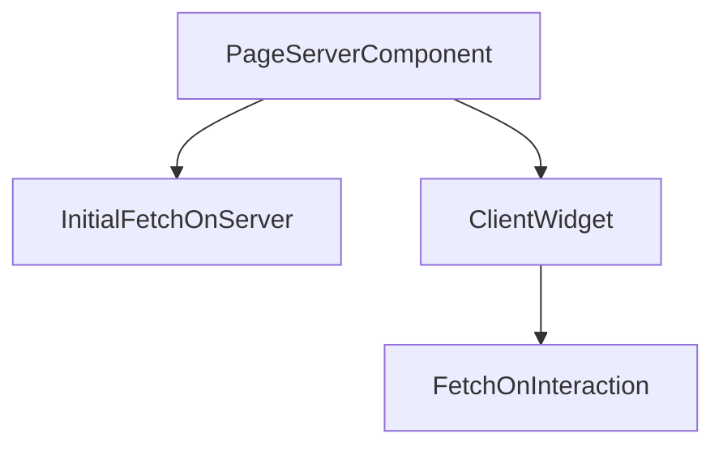

# Lesson 2: Data Fetching (Long-form Enhanced)

> Data fetching is where performance, security, and UX meet. This long-form lesson focuses on making fetching intentional: server-first by default, explicit caching intent, and predictable error handling.

## Table of Contents

- Server fetching in App Router (default)
- Client fetching (when needed)
- Loading UI + streaming mental model
- Caching intent (preview) and common pitfalls
- Troubleshooting checklist

## Learning Objectives

By the end of this lesson, you will be able to:
- Fetch data in Server Components (preferred default in App Router)
- Fetch data in Client Components (when interactivity requires it)
- Use loading UI (`app/loading.tsx`) and understand streaming basics
- Handle common fetch errors and avoid silent failures
- Recognize common pitfalls (waterfalls, double fetching, missing caching intent)

## Why Data Fetching Matters

Most frontend screens exist to display data:
- posts, products, users
- dashboards and analytics

In Next.js App Router, you can fetch data on the server by default, which often improves:
- performance (less client JS, faster first paint)
- security (keep secrets on the server)
- caching options (framework-aware caching)



## Server Components (Recommended Default)

Fetch data in Server Components (no `"use client"`).

```typescript
// app/posts/page.tsx
type Post = { id: string; title: string };

async function getPosts(): Promise<Post[]> {
  const res = await fetch("https://api.example.com/posts");
  if (!res.ok) throw new Error(`Failed to load posts: ${res.status}`);
  return res.json();
}

export default async function PostsPage() {
  const posts = await getPosts();

  return (
    <div>
      {posts.map((post) => (
        <div key={post.id}>{post.title}</div>
      ))}
    </div>
  );
}
```

### Why server fetching is often better

- no “loading spinner then content” for the initial HTML (in many cases)
- you avoid exposing API keys to the browser
- you can keep request logic close to the route that needs it

## Caching Intent (Preview)

In App Router, you should be explicit about your caching intent. A very rough mental model:
- “Is this safe to cache?”
- “How fresh does it need to be?”

You’ll see patterns like:
- `cache: "no-store"` for always-fresh data (often authenticated)
- revalidation strategies for mostly-static content

Example (conceptual):

```typescript
await fetch("https://api.example.com/posts", { cache: "no-store" });
```

## Client-Side Fetching (When Needed)

Use client-side fetching when:
- data depends on user interactions (filters/search)
- you need browser-only APIs
- you want periodic refresh/polling

```typescript
"use client";

import { useEffect, useState } from "react";

type Post = { id: string; title: string };

export default function ClientPosts() {
  const [posts, setPosts] = useState<Post[]>([]);
  const [error, setError] = useState<string | null>(null);

  useEffect(() => {
    let cancelled = false;

    fetch("/api/posts")
      .then((res) => {
        if (!res.ok) throw new Error(`HTTP ${res.status}`);
        return res.json();
      })
      .then((data: Post[]) => {
        if (!cancelled) setPosts(data);
      })
      .catch((e: unknown) => {
        if (!cancelled) setError(e instanceof Error ? e.message : "Unknown error");
      });

    return () => {
      cancelled = true;
    };
  }, []);

  if (error) return <div>Failed to load: {error}</div>;
  return <div>{posts.map((p) => <div key={p.id}>{p.title}</div>)}</div>;
}
```

## Loading UI (`app/loading.tsx`)

App Router supports `loading.tsx` for route-level loading UI while server components stream.

```typescript
// app/posts/loading.tsx
export default function Loading() {
  return <div>Loading posts...</div>;
}
```

### Mental model

- Next.js can start rendering UI and stream pieces as data resolves

## Common Pitfalls and Solutions

### Pitfall 1: Waterfall fetching

**Problem:** You fetch sequentially when requests could be parallel, slowing the page.

**Solution:** Start independent fetches together and `await` them later:

```typescript
const postsPromise = fetch("/api/posts");
const userPromise = fetch("/api/me");
const [postsRes, userRes] = await Promise.all([postsPromise, userPromise]);
```

### Pitfall 2: Double fetching (server + client)

**Problem:** You fetch the same data in a server component and then again in a client component on mount.

**Solution:** Decide where the “source of truth” is:
- server fetch for initial render
- client fetch only for interactive refreshes

### Pitfall 3: Silent failures

**Problem:** You ignore `res.ok` and render empty UI when the request failed.

**Solution:** Always check `res.ok` and surface a useful error message (and log server-side when appropriate).

## Troubleshooting

### Issue: “Fetch works in the browser but fails on the server”

**Common causes:**
- missing environment variables (server-only secrets)
- calling a URL that is only reachable from the browser
- CORS misunderstandings when calling external APIs

**Fixes:**
1. Confirm the URL is reachable from the server environment.
2. Keep secrets server-side and pass only safe data to clients.

### Issue: You see “loading spinners” everywhere

**Fixes:**
1. Default to server fetching for the initial page HTML when possible.
2. Use client fetching only for interactive updates.
- `loading.tsx` displays while the segment is waiting

## Avoiding Waterfalls

A “waterfall” happens when you await fetches sequentially that could be parallel.

Prefer:

```typescript
const [posts, user] = await Promise.all([getPosts(), getUser()]);
```

instead of awaiting one and then the other if they are independent.

## Real-World Scenario: Where to Fetch Data

Common pattern:
- Server Component fetches initial data (fast, secure)
- Client Component handles interactive updates (filters, sorting, pagination)



## Best Practices

### 1) Default to server fetching

Use client fetching when you truly need browser-side updates.

### 2) Always handle non-OK responses

Check `res.ok` so you don’t silently render “undefined” data.

### 3) Keep data boundaries clear

Use typed DTOs (`type Post = ...`) so you don’t spread `any` through your UI.

## API Clients and Libraries

While the built-in `fetch` is sufficient, many teams prefer libraries for convenience, error handling, and features.

### `axios` (HTTP client)
- Axios provides a nicer API for request/response transforms, interceptors, and automatic JSON parsing.
- It works in both server and client code (Node + browser).

Basic axios example (client):

```typescript
import axios from "axios";
import { useEffect, useState } from "react";

export default function ClientPostsAxios() {
  const [posts, setPosts] = useState<any[]>([]);

  useEffect(() => {
    let cancelled = false;
    axios.get('/api/posts')
      .then((res) => !cancelled && setPosts(res.data))
      .catch((e) => console.error(e));
    return () => { cancelled = true; };
  }, []);

  return <div>{posts.map(p => <div key={p.id}>{p.title}</div>)}</div>;
}
```

Use axios interceptors for auth token injection and centralized error handling.

### React Query / SWR (data-fetching + caching)
- For complex client caching, background revalidation, optimistic updates, retries, and pagination, use React Query (TanStack Query) or SWR.
- These libraries provide hooks that manage loading/error state, cache, and background refetching.

React Query example (client):

```typescript
import { useQuery, useMutation, useQueryClient } from '@tanstack/react-query'
import axios from 'axios'

function fetchPosts() {
  return axios.get('/api/posts').then(r => r.data)
}

export function PostsList() {
  const { data, error, isLoading } = useQuery(['posts'], fetchPosts, { staleTime: 1000 * 60 });

  if (isLoading) return <div>Loading...</div>;
  if (error) return <div>Error</div>;

  return <div>{data.map((p:any) => <div key={p.id}>{p.title}</div>)}</div>;
}
```

When to use these libraries:
- Use React Query/SWR when you need caching, background revalidation, pagination helpers, or optimistic updates.
- Keep server components for initial rendering and React Query in client components for interactive caching.

### Mutations, pagination, optimistic updates
- Use library-provided `useMutation` and query invalidation patterns for safe updates.
- For pagination, prefer cursor-based approaches and use library helpers or fetch-more patterns.

## Errors, Retries, and Backoff

- Use exponential backoff for retries; many libraries provide built-in retry strategies.
- Surface errors clearly to the user and log server-side when appropriate.

## Exercises (data fetching + libraries)


## Common Pitfalls and Solutions

### Pitfall 1: Double fetching (server + client)

**Problem:** You fetch in a server component and then fetch the same data again in a client component on mount.

**Solution:** Pass initial data into the client component as props and only refetch on interaction.

### Pitfall 2: Fetching secrets in the client

**Problem:** API keys get bundled into browser JavaScript.

**Solution:** Fetch on the server or via route handlers, never directly in the client.

### Pitfall 3: Unclear caching behavior

**Problem:** Data updates don’t appear when expected, or you refetch too often.

**Solution:** Make caching intent explicit (advanced topic) and test behavior with real endpoints.

## Troubleshooting

### Issue: "Failed to fetch" in the browser

**Symptoms:**
- client component fetch fails immediately

**Solutions:**
1. Confirm the API route exists and is reachable (`/api/posts`).
2. Check CORS if calling an external domain directly from the browser.
3. Inspect the Network tab for status code and error details.

### Issue: Server fetch works locally but fails in production

**Symptoms:**
- production errors or timeouts

**Solutions:**
1. Confirm environment variables/secrets are configured for production.
2. Confirm the external API allows calls from your deployed environment.

## Next Steps

Now that you understand the core data fetching approaches:

1. ✅ **Practice**: Fetch posts in a server page and render them
2. ✅ **Experiment**: Add a client-side filter that refetches based on user input
3. 📖 **Next Lesson**: Learn about [Server Components](./lesson-03-server-components.md)
4. 💻 **Complete Exercises**: Work through [Exercises 03](./exercises-03.md)

## Additional Resources

- [Next.js Docs: Data Fetching](https://nextjs.org/docs/app/building-your-application/data-fetching/fetching)
- [Next.js Docs: Loading UI](https://nextjs.org/docs/app/building-your-application/routing/loading-ui-and-streaming)

---

**Key Takeaways:**
- Server component fetching is the default and often best for initial data.
- Client fetching is for interactivity and browser-driven updates.
- Always handle non-OK responses and show clear loading/error states.
- Avoid waterfalls by fetching independent data in parallel.
