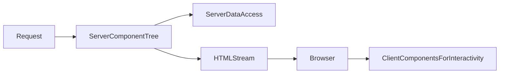

# Lesson 3: Server Components

## Learning Objectives

By the end of this lesson, you will be able to:
- Explain what Server Components are and why Next.js defaults to them in the App Router
- Decide when a component should be server vs client (and understand the boundary)
- Fetch data on the server safely and pass serializable props to client components
- Understand common composition patterns (server shell + client widgets)
- Recognize common pitfalls (hooks in server components, non-serializable props, accidental client bloat)

## Prerequisites

Before you start, make sure you have:

1. A Next.js App Router project created (follow `fs-course-frontend/LEARNING-GUIDE.md`)
2. A working `project/` folder where you’re writing code for this course (recommended location: `fs-course-frontend/project/`)
3. Basic familiarity with:
   - React components and props
   - `fetch` and async/await
   - TypeScript object types

## Why Server Components Matter

Server Components help you ship less JavaScript to the browser while still building rich UIs.

They’re especially powerful for:
- initial data loading
- secure access to server resources (DB/internal services)
- improving perceived performance (faster first render)



## Basic Implementation

In this deep dive, you’ll build a small “Product Page” using the most common Server/Client composition pattern:

- **Server component**: loads data and renders the page shell
- **Client component**: handles interactive UI (button clicks, local state)

### Step 1: Create a server-only data function

Create `project/lib/products.ts`:

```typescript
// project/lib/products.ts
export type Product = {
  id: string;
  name: string;
  priceCents: number;
};

// In a real app, this could query a DB or call your backend API.
export async function getProductById(id: string): Promise<Product> {
  // Simulate server-side work
  await new Promise((r) => setTimeout(r, 150));

  // Minimal demo data
  return {
    id,
    name: id === "1" ? "Wireless Mouse" : "Keyboard",
    priceCents: id === "1" ? 2999 : 4999,
  };
}
```

Why this belongs on the server:
- it can safely use secrets/DB connections (not shown here)
- it avoids shipping this code to the browser

### Step 2: Create a server page that fetches and renders data

Create `project/app/products/[id]/page.tsx`:

```typescript
// project/app/products/[id]/page.tsx
import { getProductById } from "../../../lib/products";
import { AddToCartButton } from "./AddToCartButton";

export default async function ProductPage({
  params,
}: {
  params: Promise<{ id: string }>;
}) {
  const { id } = await params;
  const product = await getProductById(id);

  return (
    <main style={{ padding: 24 }}>
      <h1>{product.name}</h1>
      <p>Price: ${(product.priceCents / 100).toFixed(2)}</p>

      {/* Client Component for interactivity */}
      <AddToCartButton productId={product.id} />
    </main>
  );
}
```

Key point:
- This file is a **Server Component** by default (no `"use client"`), so it can `await` data directly.

### Step 3: Add a client component for interactivity

Create `project/app/products/[id]/AddToCartButton.tsx`:

```typescript
// project/app/products/[id]/AddToCartButton.tsx
"use client";

import { useState } from "react";

export function AddToCartButton({ productId }: { productId: string }) {
  const [count, setCount] = useState(0);

  return (
    <div style={{ marginTop: 16 }}>
      <button onClick={() => setCount((c) => c + 1)}>Add to cart</button>
      <p style={{ marginTop: 8 }}>Added: {count}</p>

      {/* Demonstrates boundary-safe props: string is serializable */}
      <small>Product ID: {productId}</small>
    </div>
  );
}
```

### Step 4: Learn the boundary rule (serializable props only)

The server → client boundary only allows **serializable** data:
- ✅ strings, numbers, booleans
- ✅ plain objects/arrays (JSON-like)
- ❌ functions
- ❌ class instances
- ❌ database clients / connections

## Server Components by Default (App Router)

In App Router, components are Server Components by default:

```typescript
// This runs on the server
export default async function Page() {
  const data = await fetchFromDatabase();
  return <div>{data}</div>;
}
```

### What “runs on the server” means

- the code executes in a server environment (Node.js)
- you can’t use browser-only APIs (`window`, `document`, `localStorage`)
- you can’t use client hooks (`useState`, `useEffect`) unless you opt into client components

## Benefits

- **Less client JavaScript**: smaller bundles, faster load
- **Secure access**: API keys and DB queries stay on the server
- **Performance options**: streaming, caching, and server-first data fetching patterns
- **Cleaner boundaries**: server does data + composition; client does interactivity

## When to Use Client Components

Use `"use client"` for:
- **Interactivity**: `onClick`, `onChange`, forms, modals
- **React hooks**: `useState`, `useEffect`, `useRef`
- **Browser APIs**: `localStorage`, `navigator`, `window`
- **Client-only libraries**: many charting editors, some UI libraries

### Example: a small client widget

```typescript
"use client";

import { useState } from "react";

export function ClientCounter() {
  const [count, setCount] = useState(0);
  return <button onClick={() => setCount((c) => c + 1)}>{count}</button>;
}
```

## Combining Server and Client (Common Pattern)

Server page fetches data and renders client widgets:

```typescript
// Server Component (no "use client")
export default async function Page() {
  const data = await fetchData();

  return (
    <div>
      <ServerData data={data} />
      <ClientInteractive />
    </div>
  );
}
```

### Key rule: props across the boundary must be serializable

Passing these is usually fine:
- strings, numbers, booleans
- plain objects/arrays (JSON-like)

Avoid passing:
- functions
- class instances
- database clients/connection handles

## Real-World Scenario: Product Page

Typical pattern:
- server component loads product details
- client component manages “add to cart” interactions

This keeps sensitive logic on the server but still provides a great UX.

## Complete Example: Product Page (Server + Client Composition)

Here’s what you should have after completing the steps above:

```text
project/
└── app/
    └── products/
        └── [id]/
            ├── AddToCartButton.tsx   # client component
            └── page.tsx              # server component
project/
└── lib/
    └── products.ts                   # server-only data function
```

Try visiting:
- `http://localhost:3000/products/1`
- `http://localhost:3000/products/2`

## Best Practices

### 1) Default to server; isolate interactivity

Make client components small and leaf-level when possible.

### 2) Keep data fetching close to the route

Fetch in server pages/layouts and pass down typed, serializable data.

### 3) Avoid unnecessary `"use client"`

Adding `"use client"` at the top of a large layout can ship a lot of JS.

## Common Pitfalls and Solutions

### Pitfall 1: Using hooks in a server component

**Problem:** `useState`/`useEffect` in a server component.

**Solution:** Move that piece into a client component and render it from the server component.

### Pitfall 2: Passing functions to client components

**Problem:** You try to pass a callback from server to client.

**Solution:** Keep callbacks inside the client component, or use server actions (advanced topic).

### Pitfall 3: Accidental client “bloat”

**Problem:** Marking too much UI as client components increases bundle size.

**Solution:** Keep client components minimal and compose them into server pages.

## Troubleshooting

### Issue: "You're importing a component that needs useState/useEffect..."

**Symptoms:**
- Next.js complains about hook usage

**Solutions:**
1. Ensure the component using hooks has `"use client"`.
2. Split the component: server shell + client widget.

### Issue: "Functions cannot be passed to Client Components..."

**Symptoms:**
- error about passing functions across boundary

**Solutions:**
1. Replace function props with serializable data props.
2. Move the logic into the client component.

## Testing Your Implementation

### Manual smoke test

1. Start the dev server from your `project/` folder (per `LEARNING-GUIDE.md`).
2. Visit `http://localhost:3000/products/1`.
3. Confirm:
   - product name + price render immediately (server-rendered)
   - button increments “Added” count (client interactivity)

### Build-time safety checks

Run a production build (this catches many Server/Client boundary mistakes early):

```bash
pnpm build
```

If you see errors about hooks or serialization, use the Troubleshooting section above to fix the boundary.

## Next Steps

Now that you understand Server Components:

1. ✅ **Practice**: Build a server page that fetches data and renders it
2. ✅ **Experiment**: Add a small client widget that interacts with that data
3. 📖 **Next Level**: Move to API integration
4. 💻 **Complete Exercises**: Work through [Exercises 03](./exercises-03.md)

## Additional Resources

- [Next.js Docs: Server and Client Components](https://nextjs.org/docs/app/building-your-application/rendering/composition-patterns)
- [React Docs: Server Components](https://react.dev/reference/react/use-server)

---

**Key Takeaways:**
- Server Components are default in App Router and help ship less JS.
- Use client components for interactivity and hooks.
- Pass only serializable props across the server→client boundary.
- Compose server shells with small client widgets for the best performance/UX.
