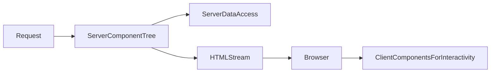

# Lesson 3: Server Components (Long-form Enhanced)

> Server Components are the biggest “App Router mental model shift” for developers coming from SPA React. This lesson is long-form so you can use it as a reference when you hit boundary errors or performance issues later.

## Table of Contents

- What Server Components are (and what they are not)
- Server vs client boundary rules
- Common composition patterns (server shell + client islands)
- Data fetching + serializable props
- Advanced topics (preview): server actions, streaming, avoiding client bloat
- Troubleshooting checklist

## Learning Objectives

By the end of this lesson, you will be able to:
- Explain what Server Components are and why Next.js defaults to them in the App Router
- Decide when a component should be server vs client (and understand the boundary)
- Fetch data on the server safely and pass serializable props to client components
- Understand common composition patterns (server shell + client widgets)
- Recognize common pitfalls (hooks in server components, non-serializable props, accidental client bloat)

## Why Server Components Matter

Server Components help you ship less JavaScript to the browser while still building rich UIs.

They’re especially powerful for:
- initial data loading
- secure access to server resources (DB/internal services)
- improving perceived performance (faster first render)



## Server Components by Default (App Router)

In App Router, components are Server Components by default:

```typescript
// This runs on the server
export default async function Page() {
  const data = await fetchFromDatabase();
  return <div>{data}</div>;
}
```

### What “runs on the server” means

- the code executes in a server environment (Node.js)
- you can’t use browser-only APIs (`window`, `document`, `localStorage`)
- you can’t use client hooks (`useState`, `useEffect`) unless you opt into client components

## Benefits

- **Less client JavaScript**: smaller bundles, faster load
- **Secure access**: API keys and DB queries stay on the server
- **Performance options**: streaming, caching, and server-first data fetching patterns
- **Cleaner boundaries**: server does data + composition; client does interactivity

## When to Use Client Components

Use `"use client"` for:
- **Interactivity**: `onClick`, `onChange`, forms, modals
- **React hooks**: `useState`, `useEffect`, `useRef`
- **Browser APIs**: `localStorage`, `navigator`, `window`
- **Client-only libraries**: many charting editors, some UI libraries

### Example: a small client widget

```typescript
"use client";

import { useState } from "react";

export function ClientCounter() {
  const [count, setCount] = useState(0);
  return <button onClick={() => setCount((c) => c + 1)}>{count}</button>;
}
```

## Combining Server and Client (Common Pattern)

Server page fetches data and renders client widgets:

```typescript
// Server Component (no "use client")
export default async function Page() {
  const data = await fetchData();

  return (
    <div>
      <ServerData data={data} />
      <ClientInteractive />
    </div>
  );
}
```

### Key rule: props across the boundary must be serializable

Passing these is usually fine:
- strings, numbers, booleans
- plain objects/arrays (JSON-like)

Avoid passing:
- functions
- class instances
- database clients/connection handles

## Advanced Topics (Preview)

### 1) Keep “client bloat” under control

A single `"use client"` at the top of a large shared layout can accidentally ship a lot of JavaScript.

Rule of thumb:
- keep layouts server-side by default
- make small client “islands” for interactivity

### 2) Streaming is a UX tool

Streaming isn’t just a performance trick—it improves perceived speed by showing useful UI early.
Use `loading.tsx` and sensible skeletons for routes that do real server work.

### 3) Server Actions (concept)

Server actions can move some “submit form → server mutation” flows back to the server boundary.
Treat them as an advanced tool: great when used intentionally, confusing when mixed randomly with client fetching.

## Real-World Scenario: Product Page

Typical pattern:
- server component loads product details
- client component manages “add to cart” interactions

This keeps sensitive logic on the server but still provides a great UX.

## Best Practices

### 1) Default to server; isolate interactivity

Make client components small and leaf-level when possible.

### 2) Keep data fetching close to the route
### 3) Treat the server/client boundary as an API boundary

Only pass what you’re comfortable “shipping” to the browser:
- never pass secrets
- avoid leaking internal-only fields (like database IDs if they’re sensitive)

Fetch in server pages/layouts and pass down typed, serializable data.

### 3) Avoid unnecessary `"use client"`

Adding `"use client"` at the top of a large layout can ship a lot of JS.

## Common Pitfalls and Solutions

### Pitfall 1: Using hooks in a server component

**Problem:** `useState`/`useEffect` in a server component.

**Solution:** Move that piece into a client component and render it from the server component.

### Pitfall 2: Passing functions to client components

**Problem:** You try to pass a callback from server to client.

**Solution:** Keep callbacks inside the client component, or use server actions (advanced topic).

### Pitfall 3: Accidental client “bloat”

**Problem:** Marking too much UI as client components increases bundle size.

**Solution:** Keep client components minimal and compose them into server pages.

## Troubleshooting

### Issue: “Hooks can only be used in Client Components”

**Fixes:**
1. Add `"use client"` to the component that uses hooks.
2. Prefer isolating hook usage into small leaf components.

### Issue: “Functions cannot be passed to Client Components”

**Fixes:**
1. Replace function props with serializable data props.
2. Move logic into the client component or keep it server-side.

### Issue: "You're importing a component that needs useState/useEffect..."

**Symptoms:**
- Next.js complains about hook usage

**Solutions:**
1. Ensure the component using hooks has `"use client"`.
2. Split the component: server shell + client widget.

### Issue: "Functions cannot be passed to Client Components..."

**Symptoms:**
- error about passing functions across boundary

**Solutions:**
1. Replace function props with serializable data props.
2. Move the logic into the client component.

## Next Steps

Now that you understand Server Components:

1. ✅ **Practice**: Build a server page that fetches data and renders it
2. ✅ **Experiment**: Add a small client widget that interacts with that data
3. 📖 **Next Level**: Move to API integration
4. 💻 **Complete Exercises**: Work through [Exercises 03](./exercises-03.md)

## Additional Resources

- [Next.js Docs: Server and Client Components](https://nextjs.org/docs/app/building-your-application/rendering/composition-patterns)
- [React Docs: Server Components](https://react.dev/reference/react/use-server)

---

**Key Takeaways:**
- Server Components are default in App Router and help ship less JS.
- Use client components for interactivity and hooks.
- Pass only serializable props across the server→client boundary.
- Compose server shells with small client widgets for the best performance/UX.
