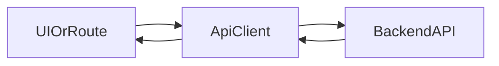
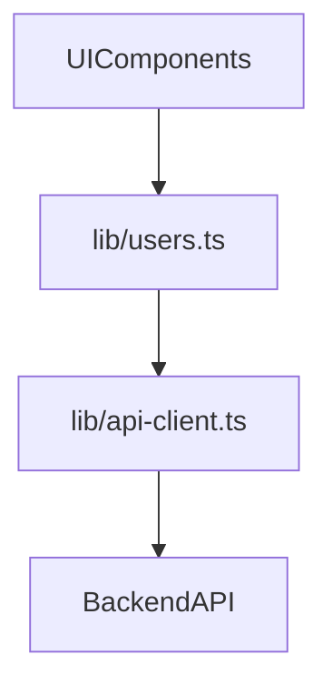

# Lesson 1: API Client Setup (Long-form Enhanced)

> A frontend that “talks to a backend” lives or dies by consistency: base URLs, headers, auth, and error shapes. This lesson is long-form so your API layer stays predictable as your app grows.

## Table of Contents

- Why an API client wrapper matters
- Base URL strategies (browser vs server)
- Typed `fetch` wrapper (happy path + error path)
- Error shape design (predictable UI handling)
- Advanced patterns (preview): auth headers/cookies, 204 handling, request ids

## Learning Objectives

By the end of this lesson, you will be able to:
- Create a reusable, typed API client wrapper around `fetch`
- Centralize base URL configuration using environment variables
- Handle JSON requests/responses consistently (headers, body, parsing)
- Represent API errors in a predictable shape
- Recognize common pitfalls (double base URLs, forgetting `Content-Type`, swallowing error bodies)

## Why an API Client Matters

In real apps, you make lots of HTTP requests. A small API client helps you:
- keep request code consistent
- avoid copy/pasting headers, base URLs, and error handling everywhere
- improve typing and readability



## Base URL Configuration

For client-side code, environment variables must be **public** to be exposed to the browser.
Next.js uses `NEXT_PUBLIC_*` for that.

```typescript
const API_URL = process.env.NEXT_PUBLIC_API_URL || "http://localhost:3001";
```

### Common pattern in this course

- frontend dev server: `http://localhost:3000`
- backend dev server: `http://localhost:3001`

## Creating a Typed API Client

This is a minimal but practical wrapper:
- builds the full URL
- sets JSON headers
- checks `response.ok`
- returns parsed JSON

```typescript
// lib/api-client.ts
const API_URL = process.env.NEXT_PUBLIC_API_URL || "http://localhost:3001";

export type ApiError = {
  status: number;
  message: string;
  details?: unknown;
};

export async function apiClient<T>(
  endpoint: string,
  options?: RequestInit
): Promise<T> {
  const response = await fetch(`${API_URL}${endpoint}`, {
    headers: {
      "Content-Type": "application/json",
      ...(options?.headers ?? {}),
    },
    ...options,
  });

  if (!response.ok) {
    let details: unknown = undefined;
    try {
      details = await response.json();
    } catch {
      // ignore JSON parse failures (could be empty or non-JSON error body)
    }

    const error: ApiError = {
      status: response.status,
      message: response.statusText || "Request failed",
      details,
    };
    throw error;
  }

  return response.json();
}
```

## Advanced Patterns (Preview)

### 1) Handling `204 No Content`

Some APIs return `204` with an empty body. If you always call `response.json()`, you may get a parsing error.
Two common solutions:
- special-case 204 in the client
- ensure the backend returns JSON consistently (even for deletes)

### 2) Auth: cookies vs Authorization header (concept)

Depending on your auth approach, your client may need to:
- include cookies (`credentials: "include"`)
- attach `Authorization: Bearer <token>` headers

Keep this logic centralized in the API client so you don’t re-implement auth in every request.

### 3) Request ids (debugging in production)

Many production APIs include an `x-request-id` header in responses.
Capturing it in error details (and surfacing it in UI logs) can make support/debugging dramatically faster.

### Why we parse the error body

Backends often return useful error info as JSON. Capturing that makes debugging and UI error messages much better.

## Using the Client

```typescript
import { apiClient } from "@/lib/api-client";

type User = { id: string; name: string; email: string };

const users = await apiClient<User[]>("/api/users");
```

## Real-World Scenario: Shared API Layer

A typical project structure:
- `lib/api-client.ts` (low-level fetch wrapper)
- `lib/users.ts` (feature-level functions like `getUsers`, `createUser`)



## Best Practices

### 1) Keep the API client small and predictable

Don’t add “magic” retries/caching until you have a clear need.

### 2) Use typed feature wrappers

Prefer `getUsers()` over sprinkling `apiClient<User[]>("/api/users")` everywhere.

### 3) Standardize error shape

Throw a consistent error object so UI can render errors reliably.

## Common Pitfalls and Solutions

### Pitfall 1: Using server-only env vars in client code

**Problem:** `process.env.API_URL` works on server but is undefined in browser.

**Solution:** Use `NEXT_PUBLIC_API_URL` for client-side access.

### Pitfall 2: Forgetting JSON headers

**Problem:** backend rejects body or parses it incorrectly.

**Solution:** Always set `Content-Type: application/json` for JSON bodies.

### Pitfall 3: Losing error details

**Problem:** You throw `new Error(statusText)` and can’t see the backend’s error payload.

**Solution:** Attempt to parse the error body and include it in the thrown object.

## Troubleshooting

### Issue: Requests go to the wrong host/port

**Symptoms:**
- 404s from the frontend server instead of the backend

**Solutions:**
1. Confirm `NEXT_PUBLIC_API_URL` is set correctly.
2. Confirm you’re calling `/api/...` endpoints on the backend URL, not `localhost:3000`.

### Issue: CORS errors in the browser

**Symptoms:**
- console shows CORS blocked requests

**Solutions:**
1. Configure CORS on the backend for your frontend origin (e.g., `http://localhost:3000`).
2. Prefer calling same-origin route handlers if you want to avoid CORS in dev (advanced).

## Next Steps

Now that you have a reusable API client:

1. ✅ **Practice**: Create a `lib/users.ts` wrapper around user endpoints
2. ✅ **Experiment**: Throw a structured `ApiError` and display `error.status` in UI
3. 📖 **Next Lesson**: Learn about [Making Requests](./lesson-02-making-requests.md)
4. 💻 **Complete Exercises**: Work through [Exercises 04](./exercises-04.md)

## Additional Resources

- [MDN: fetch](https://developer.mozilla.org/en-US/docs/Web/API/fetch)
- [Next.js Docs: Environment Variables](https://nextjs.org/docs/app/building-your-application/configuring/environment-variables)

---

**Key Takeaways:**
- A small API client prevents duplicated fetch boilerplate.
- Use `NEXT_PUBLIC_*` variables for client-side configuration.
- Standardize JSON headers, parsing, and error handling.
- Preserve backend error bodies to improve debugging and UX.
