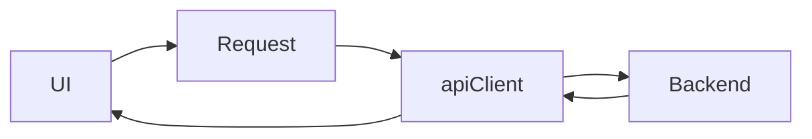

# Lesson 2: Making Requests

## Learning Objectives

By the end of this lesson, you will be able to:
- Make GET/POST/PUT/DELETE requests using your API client
- Send JSON bodies correctly and type responses
- Handle loading and error states in both server and client components
- Avoid common pitfalls (missing `JSON.stringify`, wrong endpoints, optimistic UI mistakes)

## Why This Matters

API requests are how your frontend talks to your backend:
- load lists and detail pages
- create/update/delete resources
- implement auth flows

The goal is to make requests **consistent, typed, and predictable**.



## GET Request (Read)

```typescript
type User = { id: string; name: string; email: string };

const users = await apiClient<User[]>("/api/users");
```

### Server component usage (common)

```typescript
// Server Component
export default async function Page() {
  const users = await apiClient<User[]>("/api/users");
  return (
    <ul>
      {users.map((u) => (
        <li key={u.id}>{u.email}</li>
      ))}
    </ul>
  );
}
```

## POST Request (Create)

```typescript
type User = { id: string; name: string; email: string };
type CreateUserInput = { name: string; email: string };

const payload: CreateUserInput = { name: "Alice", email: "alice@example.com" };

const newUser = await apiClient<User>("/api/users", {
  method: "POST",
  body: JSON.stringify(payload),
});
```

### Common mistake

If you forget `JSON.stringify`, the request body becomes `"[object Object]"` (or fails), and your backend won’t parse it.

## PUT Request (Update)

```typescript
type UpdateUserInput = { name?: string; email?: string };

const updated = await apiClient<User>("/api/users/123", {
  method: "PUT",
  body: JSON.stringify({ name: "Alice Updated" } satisfies UpdateUserInput),
});
```

## DELETE Request (Delete)

```typescript
await apiClient<void>("/api/users/123", {
  method: "DELETE",
});
```

Some APIs return `204 No Content`. In that case, you may choose to special-case parsing in `apiClient` later (advanced).

## Client Component Pattern: Loading + Error + Data

```typescript
"use client";

import { useEffect, useState } from "react";
import { apiClient, ApiError } from "@/lib/api-client";

type User = { id: string; email: string };

export function UsersClient() {
  const [users, setUsers] = useState<User[]>([]);
  const [loading, setLoading] = useState(true);
  const [error, setError] = useState<string | null>(null);

  useEffect(() => {
    let cancelled = false;

    apiClient<User[]>("/api/users")
      .then((data) => {
        if (!cancelled) setUsers(data);
      })
      .catch((e: unknown) => {
        const message =
          typeof e === "object" && e && "message" in e
            ? String((e as ApiError).message)
            : "Unknown error";
        if (!cancelled) setError(message);
      })
      .finally(() => {
        if (!cancelled) setLoading(false);
      });

    return () => {
      cancelled = true;
    };
  }, []);

  if (loading) return <div>Loading...</div>;
  if (error) return <div>Failed: {error}</div>;
  return <div>{users.map((u) => <div key={u.id}>{u.email}</div>)}</div>;
}
```

## Real-World Scenario: Form Submission

Typical create flow:
- local input state
- submit handler calls `apiClient(...)`
- show success/error UI

Avoid doing API calls in render; do them in event handlers or server components.

## Best Practices

### 1) Type inputs and outputs

Define `CreateUserInput` and `User` so your UI and requests stay consistent.

### 2) Handle non-OK responses

Your API client should throw a structured error; your UI should render it.

### 3) Keep requests close to the feature

Wrap endpoints into small helpers like `lib/users.ts` (advanced but recommended).

## Common Pitfalls and Solutions

### Pitfall 1: Calling the wrong URL

**Problem:** You hit `localhost:3000/api/...` accidentally.

**Solution:** Use a single base URL in your `apiClient` and keep endpoints consistent.

### Pitfall 2: Double fetching

**Problem:** You fetch in a server page and again in a client component on mount.

**Solution:** Pass server-fetched data to the client component and only refetch when needed.

### Pitfall 3: Not showing loading/error states

**Problem:** UI flashes empty or fails silently.

**Solution:** Always render an explicit loading state and an error state.

## Troubleshooting

### Issue: Backend returns 400/500 and UI shows generic error

**Symptoms:**
- you can’t see the backend validation error message

**Solutions:**
1. Ensure your API client parses and re-throws error response JSON.
2. Log the error `details` in dev to see what the backend returned.

### Issue: Request body is empty on backend

**Symptoms:**
- backend logs show missing fields

**Solutions:**
1. Ensure `body: JSON.stringify(payload)` is used.
2. Ensure `Content-Type: application/json` header is set.

## Next Steps

Now that you can make requests:

1. ✅ **Practice**: Implement a create + list flow (POST then GET)
2. ✅ **Experiment**: Add update and delete actions in the UI
3. 📖 **Next Lesson**: Learn about [Error Handling](./lesson-03-error-handling.md)
4. 💻 **Complete Exercises**: Work through [Exercises 04](./exercises-04.md)

## Additional Resources

- [MDN: HTTP request methods](https://developer.mozilla.org/en-US/docs/Web/HTTP/Methods)
- [React Docs: Handling Events](https://react.dev/learn/responding-to-events)

---

**Key Takeaways:**
- Use typed GET/POST/PUT/DELETE calls through a shared API client.
- Always `JSON.stringify` request bodies and set JSON headers.
- Render loading and error states so failures are visible and debuggable.
- Avoid double fetching by choosing server-first or client-first intentionally.
