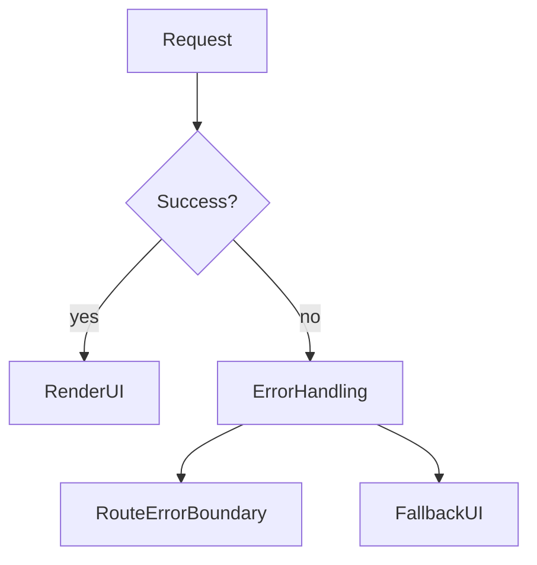

# Lesson 3: Error Handling (Long-form Enhanced)

> Error handling is part of your UI contract. This lesson focuses on building predictable failure UX: route boundaries, useful messages, safe details, and retry paths.

## Table of Contents

- Where errors happen (server vs client)
- Local try/catch vs route error boundaries
- Loading + retry/reset flows
- Expected vs unexpected errors
- Advanced patterns (preview): error codes, logging/reporting, not-found

## Learning Objectives

By the end of this lesson, you will be able to:
- Handle errors in Server Components (try/catch and “fail fast” thinking)
- Use route-level error boundaries (`app/error.tsx`) in the App Router
- Provide good UX with loading UI (`loading.tsx`) and retry/reset flows
- Recognize common pitfalls (swallowing errors, generic messages, retry loops)

## Why Error Handling Matters

In real apps, failures are normal:
- network timeouts
- backend validation errors
- 401/403 auth issues
- 500s during deployments

Good error handling:
- prevents blank screens
- shows actionable messages
- makes debugging faster



## Try/Catch in Server Components

Server components can catch async errors while fetching data:

```typescript
export default async function Page() {
  try {
    const data = await fetchData();
    return <div>{data}</div>;
  } catch (error) {
    return <div>Error loading data</div>;
  }
}
```

### When to use this approach

- small pages where you want a local fallback
- simple “best-effort” rendering

### When not to use it

If you catch everything and always render a generic message, you can hide bugs.
For critical pages, it can be better to let the error boundary handle it.

## Route Error Boundaries (`app/error.tsx`)

In App Router, you can create an error boundary at a route segment by adding `error.tsx`.

Create `app/error.tsx`:

```typescript
"use client";

export default function Error({
  error,
  reset,
}: {
  error: Error;
  reset: () => void;
}) {
  return (
    <div>
      <h2>Something went wrong!</h2>
      <p>{error.message}</p>
      <button onClick={reset}>Try again</button>
    </div>
  );
}
```

### What `reset()` does

`reset()` re-attempts rendering the segment. It’s useful for transient failures (network hiccups).

## Loading UI (`loading.tsx`)

Loading UI improves perceived performance and supports streaming:

```typescript
// app/loading.tsx
export default function Loading() {
  return <div>Loading...</div>;
}
```

### Where to put it

Place `loading.tsx` in the route segment that needs it:
- `app/loading.tsx` for global root segment
- `app/posts/loading.tsx` for posts segment only

## Error Types You’ll See (Real Apps)

### Network / fetch failures

- offline
- DNS issues
- timeouts

### Backend “expected” errors

- 400 validation errors
- 401 unauthorized / 403 forbidden
- 404 not found

### Unexpected errors

## Advanced Patterns (Preview)

### 1) Error codes over English strings

If your backend provides stable machine-readable error codes (e.g. `VALIDATION_FAILED`), your frontend can:
- show better UI messages
- render field-level validation
- avoid brittle string parsing

### 2) Not-found UI (`not-found.tsx`)

For “resource does not exist” cases, a dedicated not-found UI is often better UX than a generic error message.

### 3) Logging / reporting (production)

In production apps, you usually:
- log errors server-side (API)
- capture client errors (Sentry or similar)
- correlate issues with request ids

- 500 server bugs
- code bugs in your app

Your UI should not treat these all the same.

## Real-World Scenario: Showing Better Messages

If your API client throws structured errors (status + details), you can show different messages:
- “Please log in again” for 401
- “Not found” for 404
- “Try again later” for 500

## Best Practices

### 1) Don’t swallow errors silently

If something fails unexpectedly, you want it to surface during development.

### 2) Provide clear next actions

Include “Retry”, “Go back”, or “Contact support” depending on the page.

### 3) Separate expected vs unexpected errors

Validation errors should be shown inline near forms; unexpected errors should use boundaries.

## Common Pitfalls and Solutions

### Pitfall 1: Catching everything and showing “Error”

**Problem:** Users (and you) don’t know what happened.

**Solution:** Provide a helpful message, and log details in development.

### Pitfall 2: Retry loops

**Problem:** Auto-retrying keeps failing and spams your backend.

**Solution:** Retry only on user action (button) unless you implement a safe backoff strategy.

### Pitfall 3: Missing error boundaries

**Problem:** A thrown error results in a bad UX.

**Solution:** Add `error.tsx` at meaningful route segments.

## Troubleshooting

### Issue: Error boundary doesn’t appear

**Symptoms:**
- you expect `error.tsx` to render, but it doesn’t

**Solutions:**
1. Confirm `error.tsx` is in the correct `app/` segment folder.
2. Confirm it’s a client component (`"use client"`).

### Issue: Error boundary appears, but `reset()` doesn’t fix it

**Symptoms:**
- clicking retry keeps failing

**Solutions:**
1. Confirm the error is transient (network) vs persistent (bug).
2. Fix the underlying issue (bad endpoint, missing env vars, etc.).

## Next Steps

Now that you understand error handling basics in App Router:

1. ✅ **Practice**: Add `error.tsx` to a route and intentionally throw an error to see it render
2. ✅ **Experiment**: Add `loading.tsx` to a data-heavy route and observe the UX improvement
3. 📖 **Next Level**: Move into authentication and protecting routes
4. 💻 **Complete Exercises**: Work through [Exercises 04](./exercises-04.md)

## Additional Resources

- [Next.js Docs: Error Handling](https://nextjs.org/docs/app/building-your-application/routing/error-handling)
- [Next.js Docs: Loading UI and Streaming](https://nextjs.org/docs/app/building-your-application/routing/loading-ui-and-streaming)

---

**Key Takeaways:**
- Use error boundaries (`error.tsx`) for robust route-level error UX.
- Use `loading.tsx` to provide fast feedback while data loads.
- Avoid swallowing errors; distinguish expected (validation/auth) vs unexpected failures.
