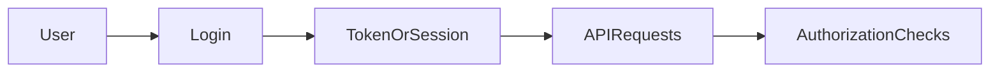

# Lesson 1: Authentication Concepts

## Learning Objectives

By the end of this lesson, you will be able to:
- Explain the difference between authentication and authorization
- Describe common auth strategies (sessions/cookies vs JWT/bearer tokens)
- Understand where tokens should be stored and why (security trade-offs)
- Recognize common web auth risks (XSS, CSRF) and how choices affect them
- Choose an auth approach appropriate for a full-stack app

## Why Authentication Matters

Authentication answers: **“Who are you?”**  
Authorization answers: **“What are you allowed to do?”**

Almost every real product needs:
- login/logout
- protected pages
- API requests that prove identity



## A Typical Authentication Flow

1. User submits credentials (email/password)
2. Server validates credentials
3. Server issues an auth credential (session cookie or token)
4. Client sends auth on subsequent requests
5. Server validates auth on each request and applies authorization rules

## Sessions vs Tokens (High-Level)

### Cookie-based sessions

- server stores session state (or signs it)
- browser automatically sends cookie with requests
- good default for many web apps

### Token-based auth (JWT / opaque bearer tokens)

- server issues a token
- client attaches it to requests (often `Authorization: Bearer ...`)
- common for APIs and multi-client systems (web + mobile)

## JWT Tokens (Common Pattern)

JSON Web Tokens are commonly used as bearer tokens:

```typescript
// Store token (example only — see storage notes below)
localStorage.setItem("token", jwtToken);

// Include in requests
headers: {
  Authorization: `Bearer ${token}`;
}
```

### Important security note: localStorage trade-offs

Storing tokens in `localStorage` is simple, but **XSS can steal tokens**.
Many production apps prefer **httpOnly cookies** for browser-based auth to reduce token theft risk.

## Token Storage Options (Trade-offs)

- **httpOnly cookies**: safer against XSS stealing tokens; can require CSRF protection depending on design
- **memory (React state)**: safest from persistence; refresh loses auth unless you refresh via cookie/refresh token
- **localStorage/sessionStorage**: easy, but increases impact of XSS

The “best” option depends on your app, threat model, and architecture.

## Session Management Helpers (Token-Based Example)

```typescript
// lib/auth.ts
export function getToken(): string | null {
  return localStorage.getItem("token");
}

export function setToken(token: string): void {
  localStorage.setItem("token", token);
}

export function removeToken(): void {
  localStorage.removeItem("token");
}
```

In a cookie-based approach, these helpers would instead check cookies (often server-side) and rely less on client storage.

## Real-World Scenario: Frontend + Backend on Different Origins

If your frontend and backend run on different hosts/ports in dev, you must think about:
- CORS (browser rules)
- cookies and `SameSite`
- secure transport (HTTPS in production)

## Best Practices

### 1) Prefer cookie-based auth for browser apps (often)

It’s a common production default because it reduces token theft risk from XSS.

### 2) Treat auth as a “boundary”

Validate on the server. Never trust client-only checks for real security.

### 3) Use least-privilege authorization

Even after authentication, check roles/ownership per request.

## Common Pitfalls and Solutions

### Pitfall 1: Confusing auth with authorization

**Problem:** You check “is logged in” but don’t check “is allowed”.

**Solution:** Add authorization checks (roles/ownership) on protected endpoints.

### Pitfall 2: Relying only on client-side checks

**Problem:** Client hides a page, but API still allows access.

**Solution:** Enforce access control on the backend for every request.

### Pitfall 3: Unsafe token storage

**Problem:** Token stored in a place easily stolen by XSS.

**Solution:** Prefer httpOnly cookies for browser flows, and reduce XSS risk with good practices.

## Troubleshooting

### Issue: Requests are “unauthorized” even after login

**Symptoms:**
- backend returns 401/403

**Solutions:**
1. Confirm the client is sending auth (cookie or `Authorization` header).
2. Confirm the token/session hasn’t expired.
3. Confirm the backend is validating the same mechanism the client is sending.

### Issue: Login works locally but fails in production

**Symptoms:**
- cookies not set/sent
- CORS errors

**Solutions:**
1. Check cookie flags (`Secure`, `SameSite`) and HTTPS usage.
2. Confirm correct `NEXT_PUBLIC_API_URL` and backend CORS settings.

## Next Steps

Now that you understand the concepts and trade-offs:

1. ✅ **Practice**: Sketch your auth flow: session cookie or bearer token?
2. ✅ **Experiment**: Implement login and store auth (with clear reasoning for storage choice)
3. 📖 **Next Lesson**: Learn about [Protected Routes](./lesson-02-protected-routes.md)
4. 💻 **Complete Exercises**: Work through [Exercises 05](./exercises-05.md)

## Additional Resources

- [OWASP: XSS](https://owasp.org/www-community/attacks/xss/)
- [OWASP: CSRF](https://owasp.org/www-community/attacks/csrf)
- [MDN: HTTP cookies](https://developer.mozilla.org/en-US/docs/Web/HTTP/Cookies)

---

**Key Takeaways:**
- Authentication proves identity; authorization enforces permissions.
- Sessions (cookies) and tokens (bearer/JWT) are both common; each has trade-offs.
- Token storage choices affect security (XSS/CSRF) and UX.
- Always enforce security on the backend; client checks are for UX, not protection.
