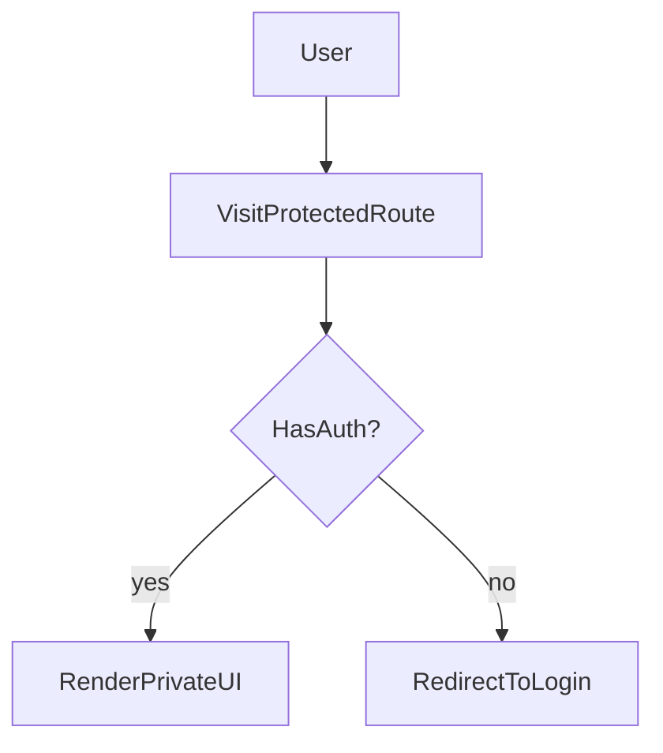

# Lesson 2: Protected Routes

## Learning Objectives

By the end of this lesson, you will be able to:
- Explain why “protected routes” are a UX concern, not true security
- Implement client-side protection patterns for UI/UX
- Use Next.js middleware for edge redirects based on cookies
- Understand when to protect routes at the page/layout level vs middleware
- Recognize common pitfalls (localStorage in SSR, hydration mismatch, redirect flicker)

## Prerequisites

Before you start, make sure you have:

1. A Next.js App Router project created (follow `fs-course-frontend/LEARNING-GUIDE.md`)
2. A `project/` folder where you’re building the course app (recommended: `fs-course-frontend/project/`)
3. A working `/login` route (or you’ll create one in this lesson)

You don’t need a real backend yet for this deep dive. We’ll simulate login/logout using Next.js route handlers that set/clear a cookie.

## Why Route Protection Matters

Protected routes improve UX by:
- preventing logged-out users from seeing private pages
- redirecting users to login quickly
- keeping navigation consistent

But remember: **real security must be enforced on the backend**.  
Route protection is about **what the user sees**, not what they can access via direct API calls.



## Basic Implementation

In this deep dive, you’ll implement protected routes using **cookie-based gating**:

- **Middleware**: redirects early (good UX, no flicker)
- **Layout-level protection**: server-side `redirect()` for a whole route segment
- **(Optional) Client wrapper**: useful for UI-only gating, but can flicker

We’ll protect `/dashboard` so:
- logged out → redirected to `/login?returnTo=/dashboard`
- logged in → dashboard renders

### Step 1: Create demo auth endpoints (set/clear a cookie)

Create `project/app/api/demo-login/route.ts`:

```typescript
// project/app/api/demo-login/route.ts
import { NextResponse } from "next/server";

export async function POST() {
  const res = NextResponse.json({ ok: true });

  // Demo cookie (real apps: HttpOnly + secure + signed token)
  res.cookies.set("token", "demo", {
    httpOnly: true,
    sameSite: "lax",
    path: "/",
  });

  return res;
}
```

Create `project/app/api/demo-logout/route.ts`:

```typescript
// project/app/api/demo-logout/route.ts
import { NextResponse } from "next/server";

export async function POST() {
  const res = NextResponse.json({ ok: true });

  // Clear cookie
  res.cookies.set("token", "", {
    httpOnly: true,
    expires: new Date(0),
    path: "/",
  });

  return res;
}
```

Why this matters:
- Middleware and server components can only see **request cookies/headers**, not `localStorage`.
- A cookie-based demo lets us exercise real Next.js “server-first” protection patterns.

### Step 2: Add middleware that redirects before the page renders

Create `project/middleware.ts`:

```typescript
// project/middleware.ts
import { NextResponse } from "next/server";
import type { NextRequest } from "next/server";

export function middleware(request: NextRequest) {
  const token = request.cookies.get("token")?.value;

  if (!token) {
    const url = request.nextUrl.clone();
    url.pathname = "/login";
    url.searchParams.set("returnTo", request.nextUrl.pathname);
    return NextResponse.redirect(url);
  }

  return NextResponse.next();
}

export const config = {
  matcher: ["/dashboard/:path*"],
};
```

Notes:
- `matcher` ensures the middleware only runs for `/dashboard/*` routes.
- This avoids protecting unrelated routes (and avoids surprises in development).

### Step 3: Create a server-protected dashboard layout

Create `project/app/dashboard/layout.tsx`:

```typescript
// project/app/dashboard/layout.tsx
import { cookies } from "next/headers";
import { redirect } from "next/navigation";
import type { ReactNode } from "react";

export default async function DashboardLayout({
  children,
}: {
  children: ReactNode;
}) {
  const cookieStore = await cookies();
  const token = cookieStore.get("token")?.value;

  // This is server-side. No flicker.
  if (!token) {
    redirect("/login?returnTo=/dashboard");
  }

  return <section style={{ padding: 24 }}>{children}</section>;
}
```

Why both middleware and layout?
- **Middleware**: earliest redirect (best UX on direct visits/refresh)
- **Layout**: defense-in-depth for the segment (also catches mistakes if middleware is misconfigured)

### Step 4: Create a minimal dashboard page

Create `project/app/dashboard/page.tsx`:

```typescript
// project/app/dashboard/page.tsx
export default function DashboardPage() {
  return (
    <main>
      <h1>Dashboard</h1>
      <p>If you can see this, you are “logged in” (demo cookie present).</p>
    </main>
  );
}
```

### Step 5: Create a login page that sets the cookie and returns you back

Create `project/app/login/page.tsx`:

```typescript
// project/app/login/page.tsx
"use client";

import { useSearchParams, useRouter } from "next/navigation";
import { useState } from "react";

export default function LoginPage() {
  const router = useRouter();
  const params = useSearchParams();
  const returnTo = params.get("returnTo") ?? "/dashboard";
  const [loading, setLoading] = useState(false);

  async function login() {
    setLoading(true);
    await fetch("/api/demo-login", { method: "POST" });
    router.replace(returnTo);
  }

  async function logout() {
    setLoading(true);
    await fetch("/api/demo-logout", { method: "POST" });
    router.replace("/login");
  }

  return (
    <main style={{ padding: 24 }}>
      <h1>Login</h1>
      <p>Return to: {returnTo}</p>

      <button disabled={loading} onClick={login}>
        Demo login (set cookie)
      </button>

      <button disabled={loading} onClick={logout} style={{ marginLeft: 12 }}>
        Demo logout (clear cookie)
      </button>
    </main>
  );
}
```

## Client-Side Protection (Component Wrapper)

This pattern checks auth on the client and redirects if missing.

```typescript
"use client";

import { useEffect, useState } from "react";
import { useRouter } from "next/navigation";

export default function ProtectedRoute({
  children,
}: {
  children: React.ReactNode;
}) {
  const router = useRouter();
  const [ready, setReady] = useState(false);
  const [authed, setAuthed] = useState(false);

  useEffect(() => {
    const token = localStorage.getItem("token");
    setAuthed(Boolean(token));
    setReady(true);

    if (!token) {
      router.push("/login");
    }
  }, [router]);

  if (!ready) return <div>Loading...</div>;
  if (!authed) return <div>Redirecting...</div>;
  return <>{children}</>;
}
```

### Why we read localStorage inside `useEffect`

`localStorage` is browser-only. Reading it during render can cause errors in server rendering contexts.

### Downside of client-only protection

You can get a “flash” (redirect flicker) because the check happens after hydration.

## Middleware (App Router) Protection

Middleware runs before rendering and can redirect based on cookies.

```typescript
// middleware.ts
import { NextResponse } from "next/server";
import type { NextRequest } from "next/server";

export function middleware(request: NextRequest) {
  const token = request.cookies.get("token")?.value;

  if (!token && request.nextUrl.pathname.startsWith("/dashboard")) {
    return NextResponse.redirect(new URL("/login", request.url));
  }

  return NextResponse.next();
}
```

### Why middleware is powerful

- redirects happen before the page loads (better UX)
- works well for cookie-based auth

### Important limitation

Middleware can’t read browser `localStorage`. It only sees request cookies/headers.

## Layout-Level Protection (App Router Pattern)

A common pattern is to apply protection in a segment layout:
- `app/dashboard/layout.tsx` checks auth and wraps all dashboard pages

This keeps auth logic centralized and avoids repeating checks on every page.

## Real-World Scenario: Authenticated Dashboard

Common flows:
- logged out → `/dashboard` redirects to `/login`
- logged in → `/dashboard` renders
- after login → redirect back to the original route (`returnTo=/dashboard`)

## Complete Example: Protected `/dashboard` (Middleware + Layout)

After completing the steps above, your `project/` should include:

```text
project/
├── middleware.ts
└── app/
    ├── api/
    │   ├── demo-login/
    │   │   └── route.ts
    │   └── demo-logout/
    │       └── route.ts
    ├── login/
    │   └── page.tsx
    └── dashboard/
        ├── layout.tsx
        └── page.tsx
```

Try these flows:

1. Visit `http://localhost:3000/dashboard` while logged out → should redirect to `/login?returnTo=/dashboard`
2. Click “Demo login” → should return you to `/dashboard`
3. Click “Demo logout” → cookie clears, and `/dashboard` should redirect again

## Best Practices

### 1) Prefer middleware + cookies for route gating

It avoids client flicker and works consistently for navigation and refresh.

### 2) Keep client-side wrappers for UX and component-level gating

Use them for hiding parts of UI when auth state changes dynamically.

### 3) Always enforce auth on the backend

Even if routes are protected, backend endpoints must validate auth for every request.

## Common Pitfalls and Solutions

### Pitfall 1: Using `localStorage` in server components

**Problem:** `localStorage` is not defined on the server.

**Solution:** Use `useEffect` in client components or cookies on the server/middleware.

### Pitfall 2: Redirect flicker

**Problem:** UI briefly shows protected content before redirect.

**Solution:** Use middleware/cookies or render a loading state until auth is known.

### Pitfall 3: Protecting UI but not API

**Problem:** user can still call protected backend endpoints directly.

**Solution:** Backend must validate auth (JWT/session) and authorization.

## Troubleshooting

### Issue: Middleware redirect doesn’t trigger

**Symptoms:**
- `/dashboard` loads even when logged out

**Solutions:**
1. Confirm middleware is at the project root (`middleware.ts`).
2. Confirm cookie name matches (`token` vs `session`).
3. Confirm path matching logic (`startsWith("/dashboard")`) matches your routes.

### Issue: Client route protection always redirects

**Symptoms:**
- token exists but you still redirect

**Solutions:**
1. Confirm token key name is consistent (`token`).
2. Confirm you set the token after login successfully.
3. Confirm you’re not running in a server component context.

## Testing Your Implementation

### Manual test checklist

1. Start dev server from your `project/` folder.
2. In an incognito window, visit `/dashboard`.
   - Expected: redirect to `/login?returnTo=/dashboard`
3. Click “Demo login”.
   - Expected: you land on `/dashboard` and see the dashboard content
4. Refresh `/dashboard`.
   - Expected: still allowed (cookie persists)
5. Click “Demo logout”.
   - Expected: cookie clears; visiting `/dashboard` redirects again

### What this does (and does not) prove

- ✅ Confirms your **route gating UX** is working in Next.js
- ❌ Does not guarantee backend security. In real apps, your backend must validate JWT/session on every request.

## Next Steps

Now that you can protect routes:

1. ✅ **Practice**: Add middleware redirect for `/dashboard`
2. ✅ **Experiment**: Add a `returnTo` query param and redirect back after login
3. 📖 **Next Lesson**: Learn about [Session Management](./lesson-03-session-management.md)
4. 💻 **Complete Exercises**: Work through [Exercises 05](./exercises-05.md)

## Additional Resources

- [Next.js Docs: Middleware](https://nextjs.org/docs/app/building-your-application/routing/middleware)
- [Next.js Docs: Authentication](https://nextjs.org/docs/app/building-your-application/authentication)

---

**Key Takeaways:**
- Protected routes improve UX; backend checks enforce real security.
- Client-side checks can cause redirect flicker; middleware avoids it for cookie-based auth.
- Middleware reads cookies/headers, not `localStorage`.
- Centralize protection in layouts or middleware to avoid duplication.
