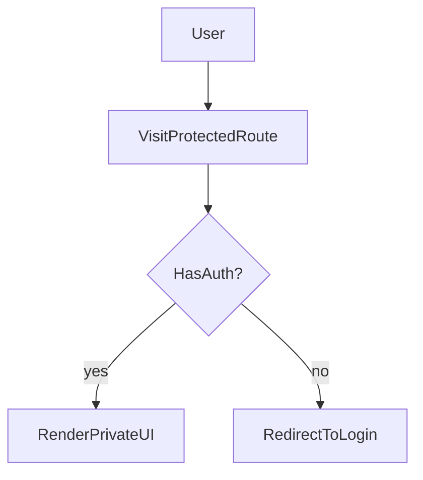

# Lesson 2: Protected Routes

## Learning Objectives

By the end of this lesson, you will be able to:
- Explain why “protected routes” are a UX concern, not true security
- Implement client-side protection patterns for UI/UX
- Use Next.js middleware for edge redirects based on cookies
- Understand when to protect routes at the page/layout level vs middleware
- Recognize common pitfalls (localStorage in SSR, hydration mismatch, redirect flicker)

## Why Protected Routes Matter

Protected routes improve UX by:
- preventing logged-out users from seeing private pages
- redirecting users to login quickly
- keeping navigation consistent

But remember: **real security must be enforced on the backend**.  
Route protection is about **what the user sees**, not what they can access via direct API calls.



## Client-Side Protection (Component Wrapper)

This pattern checks auth on the client and redirects if missing.

```typescript
"use client";

import { useEffect, useState } from "react";
import { useRouter } from "next/navigation";

export default function ProtectedRoute({
  children,
}: {
  children: React.ReactNode;
}) {
  const router = useRouter();
  const [ready, setReady] = useState(false);
  const [authed, setAuthed] = useState(false);

  useEffect(() => {
    const token = localStorage.getItem("token");
    setAuthed(Boolean(token));
    setReady(true);

    if (!token) {
      router.push("/login");
    }
  }, [router]);

  if (!ready) return <div>Loading...</div>;
  if (!authed) return <div>Redirecting...</div>;
  return <>{children}</>;
}
```

### Why we read localStorage inside `useEffect`

`localStorage` is browser-only. Reading it during render can cause errors in server rendering contexts.

### Downside of client-only protection

You can get a “flash” (redirect flicker) because the check happens after hydration.

## Middleware (App Router) Protection

Middleware runs before rendering and can redirect based on cookies.

```typescript
// middleware.ts
import { NextResponse } from "next/server";
import type { NextRequest } from "next/server";

export function middleware(request: NextRequest) {
  const token = request.cookies.get("token");

  if (!token && request.nextUrl.pathname.startsWith("/dashboard")) {
    return NextResponse.redirect(new URL("/login", request.url));
  }

  return NextResponse.next();
}
```

### Why middleware is powerful

- redirects happen before the page loads (better UX)
- works well for cookie-based auth

### Important limitation

Middleware can’t read browser `localStorage`. It only sees request cookies/headers.

## Layout-Level Protection (App Router Pattern)

A common pattern is to apply protection in a segment layout:
- `app/dashboard/layout.tsx` checks auth and wraps all dashboard pages

This keeps auth logic centralized and avoids repeating checks on every page.

## Real-World Scenario: Authenticated Dashboard

Common flows:
- logged out → `/dashboard` redirects to `/login`
- logged in → `/dashboard` renders
- after login → redirect back to the original route (`returnTo=/dashboard`)

## Best Practices

### 1) Prefer middleware + cookies for route gating

It avoids client flicker and works consistently for navigation and refresh.

### 2) Keep client-side wrappers for UX and component-level gating

Use them for hiding parts of UI when auth state changes dynamically.

### 3) Always enforce auth on the backend

Even if routes are protected, backend endpoints must validate auth for every request.

## Common Pitfalls and Solutions

### Pitfall 1: Using `localStorage` in server components

**Problem:** `localStorage` is not defined on the server.

**Solution:** Use `useEffect` in client components or cookies on the server/middleware.

### Pitfall 2: Redirect flicker

**Problem:** UI briefly shows protected content before redirect.

**Solution:** Use middleware/cookies or render a loading state until auth is known.

### Pitfall 3: Protecting UI but not API

**Problem:** user can still call protected backend endpoints directly.

**Solution:** Backend must validate auth (JWT/session) and authorization.

## Troubleshooting

### Issue: Middleware redirect doesn’t trigger

**Symptoms:**
- `/dashboard` loads even when logged out

**Solutions:**
1. Confirm middleware is at the project root (`middleware.ts`).
2. Confirm cookie name matches (`token` vs `session`).
3. Confirm path matching logic (`startsWith("/dashboard")`) matches your routes.

### Issue: Client route protection always redirects

**Symptoms:**
- token exists but you still redirect

**Solutions:**
1. Confirm token key name is consistent (`token`).
2. Confirm you set the token after login successfully.
3. Confirm you’re not running in a server component context.

## Next Steps

Now that you can protect routes:

1. ✅ **Practice**: Add middleware redirect for `/dashboard`
2. ✅ **Experiment**: Add a `returnTo` query param and redirect back after login
3. 📖 **Next Lesson**: Learn about [Session Management](./lesson-03-session-management.md)
4. 💻 **Complete Exercises**: Work through [Exercises 05](./exercises-05.md)

## Additional Resources

- [Next.js Docs: Middleware](https://nextjs.org/docs/app/building-your-application/routing/middleware)
- [Next.js Docs: Authentication](https://nextjs.org/docs/app/building-your-application/authentication)

---

**Key Takeaways:**
- Protected routes improve UX; backend checks enforce real security.
- Client-side checks can cause redirect flicker; middleware avoids it for cookie-based auth.
- Middleware reads cookies/headers, not `localStorage`.
- Centralize protection in layouts or middleware to avoid duplication.
