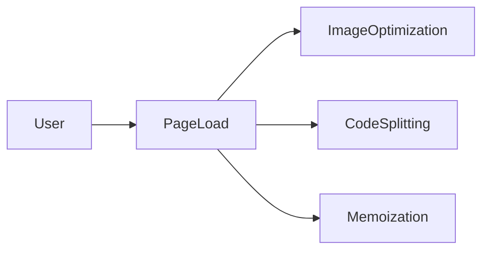

# Lesson 1: Optimization

## Learning Objectives

By the end of this lesson, you will be able to:
- Use Next.js built-in optimization primitives (images, code splitting, caching)
- Choose when to optimize (measure first, then act)
- Apply React memoization responsibly (`memo`, `useMemo`, `useCallback`)
- Recognize common pitfalls (premature memoization, hurting UX with aggressive lazy loading)

## Why Optimization Matters

Optimization is about improving:
- **load performance** (how fast users see something useful)
- **runtime performance** (how smooth interactions feel)
- **bundle size** (how much JS you ship)

Next.js provides strong defaults—your job is to use them intentionally.



## Image Optimization

Use the Next.js `Image` component for optimized loading and formats.

```typescript
import Image from "next/image";

<Image
  src="/image.jpg"
  alt="Description"
  width={500}
  height={300}
  priority // for above-the-fold images only
/>;
```

### When to use `priority`

- Use it for hero images above the fold.
- Don’t use it for everything (it can hurt page load by competing for bandwidth).

## Code Splitting (Dynamic Imports)

App Router automatically code-splits by route, but you can also split heavy components.

```typescript
import dynamic from "next/dynamic";

const HeavyComponent = dynamic(() => import("./HeavyComponent"), {
  loading: () => <p>Loading...</p>,
});
```

### When dynamic import helps

- charts, editors, large third-party libs
- components that are rarely used (advanced settings panels)

### When it can hurt

If you split something used immediately on page load, you may add an extra network round trip and make things slower.

## Memoization (React)

Memoization can reduce unnecessary re-renders, but it’s not free.

### `memo` for components

```typescript
import { memo } from "react";

export const ExpensiveComponent = memo(function ExpensiveComponent({
  data,
}: {
  data: string[];
}) {
  return <div>{data.length}</div>;
});
```

### `useMemo` and `useCallback`

- `useMemo` caches expensive calculations
- `useCallback` caches function references passed to child components

Use them when you’ve identified a real re-render problem.

## Real-World Scenario: Optimizing a Dashboard

Common wins:
- server components for initial data and layout
- dynamic import heavy widgets (charts)
- memoize expensive list items
- reduce unnecessary state updates

## Best Practices

### 1) Measure before optimizing

Use profiling tools and real device testing instead of guessing.

### 2) Prefer Next.js primitives first

Use `Image`, route-level code splitting, server components, and caching before custom hacks.

### 3) Avoid premature memoization

Overusing memoization can make code harder to read and sometimes slower.

## Common Pitfalls and Solutions

### Pitfall 1: Marking everything as `memo`

**Problem:** You add memoization everywhere and see no improvement.

**Solution:** Memoize only components that re-render often and are expensive to render.

### Pitfall 2: Lazy-loading critical UI

**Problem:** The user sees “Loading…” for the main content.

**Solution:** Split optional UI; keep primary UI available immediately.

### Pitfall 3: Overusing `priority` on images

**Problem:** Too many high-priority requests hurt the critical path.

**Solution:** Use `priority` only for the most important image(s).

## Troubleshooting

### Issue: Page feels slow but bundle size seems small

**Symptoms:**
- interactions are laggy

**Solutions:**
1. Profile React renders (find expensive components).
2. Check for large client-side computations.
3. Move more rendering/data fetching to server components.

### Issue: Dynamic import causes layout shift

**Symptoms:**
- content jumps when the component loads

**Solutions:**
1. Provide a stable loading placeholder with similar dimensions.
2. Pre-allocate space with CSS/layout structure.

## Next Steps

Now that you understand core optimization tools:

1. ✅ **Practice**: Convert an image to Next.js `Image` and compare load behavior
2. ✅ **Experiment**: Dynamic import a heavy component and add a good loading placeholder
3. 📖 **Next Lesson**: Learn about [Performance](./lesson-02-performance.md)
4. 💻 **Complete Exercises**: Work through [Exercises 06](./exercises-06.md)

## Additional Resources

- [Next.js Docs: Image Optimization](https://nextjs.org/docs/app/building-your-application/optimizing/images)
- [React Docs: memo](https://react.dev/reference/react/memo)
- [React Docs: useMemo](https://react.dev/reference/react/useMemo)

---

**Key Takeaways:**
- Use Next.js primitives (Image, route splitting, server components) first.
- Dynamic import heavy, optional UI—but avoid splitting critical UI.
- Memoization helps when measured; overuse can hurt readability and performance.
