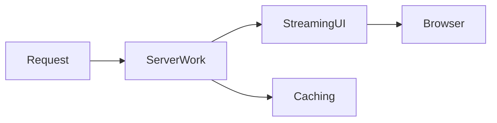
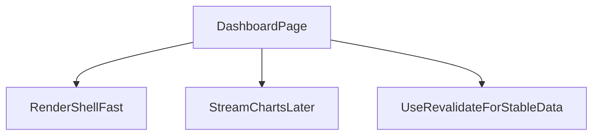

# Lesson 2: Performance

## Learning Objectives

By the end of this lesson, you will be able to:
- Identify the main performance levers in Next.js App Router
- Use Server Components to reduce client bundle size
- Use streaming + `Suspense` to improve perceived performance
- Apply caching/revalidation to balance freshness vs speed
- Recognize common pitfalls (waterfalls, unnecessary client JS, over-caching stale data)

## Why Performance Matters

Performance is a feature:
- faster apps feel more trustworthy
- slower apps lose users

In Next.js, good performance usually comes from:
- doing more work on the server
- shipping less JS to the client
- streaming UI progressively
- caching intentionally



## Server Components (Bundle Size)

Server Components reduce the amount of JavaScript shipped to the browser.

```typescript
// Server Component (doesn't add to client bundle)
export default async function Page() {
  const data = await fetchData();
  return <div>{data}</div>;
}
```

### When this helps most

- data-heavy pages (dashboards, lists)
- pages with expensive client libraries you can avoid shipping

## Streaming with `Suspense`

Next.js can stream Server Components so users see something sooner.

```typescript
import { Suspense } from "react";

function LoadingCard() {
  return <div>Loading...</div>;
}

export default function Page() {
  return (
    <div>
      <Suspense fallback={<LoadingCard />}>
        <SlowComponent />
      </Suspense>
    </div>
  );
}
```

### Mental model

Instead of waiting for everything:
- render shell immediately
- stream in slow parts as they resolve

## Caching and Revalidation

You can revalidate fetches to avoid refetching constantly while still staying fresh.

```typescript
// Revalidate every 60 seconds
const data = await fetch(url, {
  next: { revalidate: 60 },
});
```

### Trade-off

- lower revalidate = fresher data, more load
- higher revalidate = faster responses, potentially stale data

## Avoiding Waterfalls

Waterfalls happen when you fetch sequentially but could fetch in parallel.

Prefer:

```typescript
const [a, b] = await Promise.all([fetchA(), fetchB()]);
```

when the calls are independent.

## Real-World Scenario: “Fast Dashboard”

Common pattern:
- server layout renders quickly
- stream in slow sections (charts, recommendations)
- cache stable data; revalidate periodically



## Best Practices

### 1) Keep client JS small

Use client components only when you need interactivity.

### 2) Stream slow parts

Wrap slow components in `Suspense` and provide good fallbacks.

### 3) Make caching intent explicit

Choose revalidation based on real product requirements.

## Common Pitfalls and Solutions

### Pitfall 1: Everything becomes a client component

**Problem:** large bundles, slower startup.

**Solution:** default to server components, isolate interactive parts as client.

### Pitfall 2: Loading UI that shifts layout

**Problem:** fallback UI has different dimensions, causing jumps.

**Solution:** create skeletons/placeholders with similar size.

### Pitfall 3: Serving stale data unexpectedly

**Problem:** caching hides updates when you expect freshness.

**Solution:** tune `revalidate` and test behavior with real endpoints.

## Troubleshooting

### Issue: Page is slow despite server components

**Symptoms:**
- time-to-first-byte is high

**Solutions:**
1. Check backend latency (API/DB).
2. Remove sequential waterfalls.
3. Cache stable data and revalidate.

### Issue: UI feels slow after initial load

**Symptoms:**
- interactions lag

**Solutions:**
1. Profile client components and reduce re-renders.
2. Split heavy client libraries with dynamic imports.

## Next Steps

Now that you understand performance levers:

1. ✅ **Practice**: Wrap a slow component in `Suspense` and add a stable skeleton fallback
2. ✅ **Experiment**: Add `revalidate` and observe freshness vs speed
3. 📖 **Next Lesson**: Learn about [Testing](./lesson-03-testing.md)
4. 💻 **Complete Exercises**: Work through [Exercises 06](./exercises-06.md)

## Additional Resources

- [Next.js Docs: Loading UI and Streaming](https://nextjs.org/docs/app/building-your-application/routing/loading-ui-and-streaming)
- [React Docs: Suspense](https://react.dev/reference/react/Suspense)
- [Next.js Docs: Data Fetching and Caching](https://nextjs.org/docs/app/building-your-application/data-fetching/fetching)

---

**Key Takeaways:**
- Server components reduce bundle size and improve initial load.
- Streaming + Suspense improves perceived performance by rendering progressively.
- Caching and revalidation balance speed and freshness—choose intentionally.
