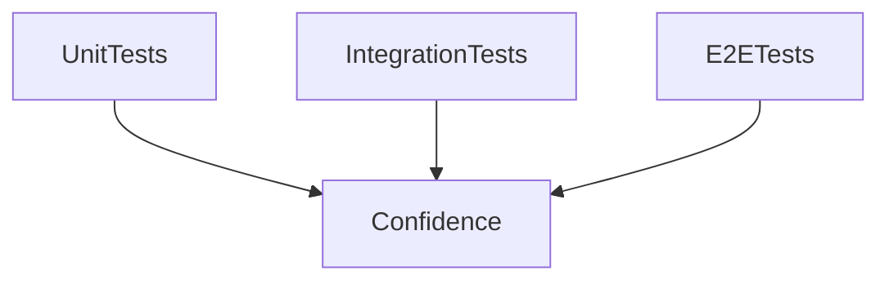
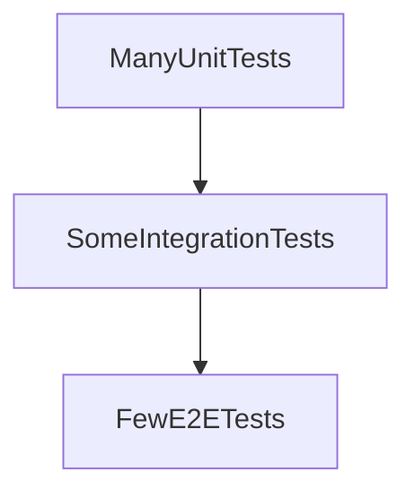

# Lesson 3: Testing (Long-form Enhanced)

> Testing is how you keep velocity without fear. This lesson is long-form because test choices are architectural: what you test shapes how you design components, routes, and APIs.

## Table of Contents

- Test types (unit vs integration vs E2E)
- React Testing Library basics (user-visible behavior)
- Playwright basics (critical flows)
- What to test vs what not to test
- Avoiding flaky tests (stability patterns)

## Learning Objectives

By the end of this lesson, you will be able to:
- Explain the difference between unit, integration, and E2E tests
- Write a basic component test with React Testing Library
- Write a basic Playwright test for a user flow
- Choose what to test (and what not to test) for a Next.js app
- Recognize common pitfalls (testing implementation details, flaky E2E tests)

## Why Testing Matters

Testing helps you ship confidently:
- prevents regressions
- documents expected behavior
- enables refactors

In real teams, good tests focus on user-visible behavior and critical flows.



## What Types of Tests Do We Use?

### Unit tests

- test small pieces (helpers, components)
- fast and cheap to run

### Integration tests

- test multiple pieces together (component + API client mock)
- still fast, more realistic than unit tests

### E2E tests

- run the app like a user (real browser)
- slowest but highest confidence for critical paths

## Unit Testing (React Testing Library)

React Testing Library encourages testing what users see, not internal implementation.

```typescript
import { render, screen } from "@testing-library/react";
import Button from "./Button";

test("renders button label", () => {
  render(<Button label="Click me" />);
  expect(screen.getByText("Click me")).toBeInTheDocument();
});
```

### A better pattern: roles

```typescript
expect(screen.getByRole("button", { name: "Click me" })).toBeInTheDocument();
```

This aligns better with accessibility and user interactions.

## E2E Testing (Playwright)

E2E tests validate real user flows:

```typescript
import { test, expect } from "@playwright/test";

test("homepage loads", async ({ page }) => {
  await page.goto("/");
  await expect(page).toHaveTitle(/Next\.js/i);
});
```

### Example: basic navigation flow

```typescript
test("can navigate to about page", async ({ page }) => {
  await page.goto("/");
  await page.getByRole("link", { name: /about/i }).click();
  await expect(page).toHaveURL(/about/);
});
```

## What Should You Test?

High-value targets:
- login/logout flow
- critical CRUD flows (create/edit/delete)
- route protection (redirects)
- error states (failed fetch shows message)

Low-value targets:
- testing every Tailwind class
- testing internal component state updates directly

## Avoiding Flaky Tests

Common causes of flakiness:
- timing issues (not waiting for UI)
- using brittle selectors (CSS class selectors)
- environment dependencies (random data, network instability)

Prefer robust selectors:
- `getByRole`, `getByLabel`, `getByText` (with care)

## Advanced Patterns (Preview)

### 1) Test “contracts”, not implementation details

Great tests assert:
- what the user sees
- what the user can do
- what the system guarantees (error messages, redirects)

Avoid brittle assertions like:
- exact Tailwind class lists
- internal state values

### 2) Make E2E reliable by controlling dependencies

E2E tests become flaky when they depend on:
- random seed data
- external services
- timing-based waits

Use:
- stable test data
- deterministic environments
- condition-based waits (Playwright auto-waits)

## Real-World Scenario: “Test Pyramid” for a Full-Stack App



Most tests should be unit/integration, with a smaller set of E2E tests covering critical paths.

## Best Practices

### 1) Test behavior, not implementation

If you refactor internals and behavior stays the same, tests should still pass.

### 2) Keep E2E tests focused

E2E tests are expensive. Cover core flows; don’t test everything via E2E.

### 3) Make tests deterministic

Use stable test data and predictable environments.

## Common Pitfalls and Solutions

### Pitfall 1: Testing Tailwind classes

**Problem:** UI refactors break tests even though behavior is the same.

**Solution:** Test visible text, roles, and user interactions.

### Pitfall 2: Flaky E2E selectors

**Problem:** `page.click(".btn-primary")` breaks when markup changes.

**Solution:** Use roles and accessible names.

### Pitfall 3: Not waiting for async UI

**Problem:** Tests assert before data is loaded.

**Solution:** Use Playwright/RTL async assertions (`toBeVisible`, `findBy...`, etc.).

## Troubleshooting

### Issue: Tests pass locally but fail in CI

**Symptoms:**
- timeouts, slower environment issues

**Solutions:**
1. Increase timeouts for slow CI environments (sparingly).
2. Ensure test data is stable.
3. Avoid relying on external network calls in tests.

### Issue: E2E tests are inconsistent

**Symptoms:**
- tests fail intermittently

**Solutions:**
1. Replace brittle selectors with `getByRole`.
2. Add explicit waits for expected UI changes.

## Next Steps

Now that you understand the testing landscape:

1. ✅ **Practice**: Write one RTL test for a UI component
2. ✅ **Experiment**: Write one Playwright test for a navigation flow
3. 📖 **Deepen**: Use the dedicated testing course for full coverage
4. 💻 **Complete Exercises**: Work through [Exercises 06](./exercises-06.md)

## Additional Resources

- [Testing Library Docs](https://testing-library.com/docs/)
- [Playwright Docs](https://playwright.dev/docs/intro)
- See `fs-course-testing/` for the full testing track

---

**Key Takeaways:**
- Use unit/integration tests for most coverage; use E2E for critical flows.
- Prefer testing behavior via roles and user interactions.
- Keep tests deterministic and avoid brittle selectors/timing issues.
